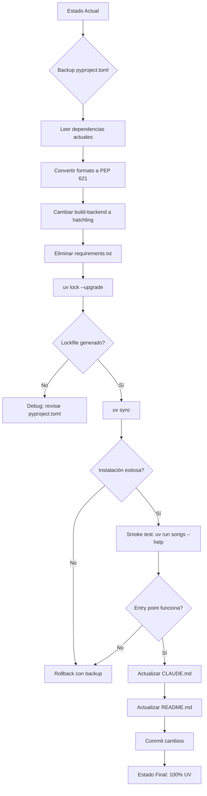

# Plan de Trabajo: Task-01 - Migración a UV para Gestión de Dependencias

**Fecha de Creación**: 2025-12-28
**Versión**: 1.0
**Estado**: Pendiente de Aprobación
**Autor**: Claude Code
**Stack**: UV (gestor de dependencias Python moderno), MCP (stdio) + ChromaDB (embedded) + Anthropic Claude + sentence-transformers

---

## Historial de Revisiones

| Versión | Fecha | Cambios | Motivo |
|---------|-------|---------|--------|
| 1.0 | 2025-12-28 | Plan inicial | Creación del workplan para migración a UV dependency management |

---

## 1. Resumen Ejecutivo

### Descripción General

Esta tarea busca **modernizar la gestión de dependencias** del proyecto `sort-google-scholar-mcp` migrando completamente de setuptools tradicional a `uv`, el gestor de dependencias Python de próxima generación desarrollado por Astral (creadores de Ruff).

**Contexto actual:**
- El proyecto usa `pyproject.toml` con formato setuptools tradicional (dependencies como array inline)
- Existe un archivo `requirements.txt` legacy
- Ya se generó un `uv.lock` (trabajo parcial iniciado)
- Las dependencias se listan manualmente en `pyproject.toml`

**Problema a resolver:**
- Gestión manual de dependencias propensa a errores
- Formato pyproject.toml no compatible con workflow moderno de uv
- Duplicación entre requirements.txt y pyproject.toml
- No se aprovechan las ventajas de uv: resolución ultra-rápida, lockfile determinista, comandos ergonómicos

**Solución propuesta:**
Eliminar archivos legacy y convertir el proyecto a un workflow 100% basado en uv, donde:
- `pyproject.toml` usa formato estándar PEP 621
- Todas las dependencias se gestionan con `uv add`
- `uv.lock` es la fuente de verdad para versiones exactas
- Workflow de desarrollo es más rápido y confiable

### Alcance y Objetivos Principales

**Objetivos:**
1. ✅ Convertir `pyproject.toml` al formato estándar PEP 621 compatible con uv
2. ✅ Eliminar archivo `requirements.txt` legacy
3. ✅ Regenerar `uv.lock` limpio con todas las dependencias correctas
4. ✅ Actualizar documentación (CLAUDE.md, README.md) con comandos uv
5. ✅ Verificar que ambos entry points funcionen (`sortgs` y `sortgs-mcp`)

**Componentes del sistema MCP afectados:**
- ❌ **MCP Tools**: No afectados (solo infraestructura)
- ❌ **Scraping/PDF/RAG**: No afectados (solo cambio de instalación)
- ✅ **Config & Setup**: `pyproject.toml`, instalación, documentación

**Referencia a fase del MCP_PLAN.md:**
Esta tarea es **pre-requisito de Fase 0** (Setup). Aunque Fase 0 ya está parcialmente completada, esta mejora de infraestructura es independiente y mejora el proceso de desarrollo para todas las fases futuras.

### Estimación de Tiempo y Recursos

**Duración estimada:** 2-3 horas

**Breakdown:**
- Conversión de pyproject.toml: 30-45 min
- Regeneración de uv.lock y validación: 15-30 min
- Actualización de documentación: 30-45 min
- Testing (smoke test manual): 30-45 min
- Buffer para imprevistos: 15-30 min

**Recursos necesarios:**
- `uv` instalado (ya presente según evidencia de uv.lock)
- Python >=3.8 (requisito actual del proyecto)
- Acceso al repositorio git

---

## 2. Priorización del Alcance

### 🔴 MVP/CORE (Obligatorio)

**Criterio de éxito:** El proyecto puede instalarse y ejecutarse con `uv` sin romper funcionalidad existente.

**Funcionalidades core:**
- [ ] **pyproject.toml en formato PEP 621**: Conversión completa con metadata correcta
- [ ] **Dependencias migradas correctamente**: Todas las 15 dependencias actuales presentes
- [ ] **uv.lock regenerado**: Lockfile limpio y determinista
- [ ] **Entry points funcionales**: `sortgs` y `sortgs-mcp` ejecutables vía `uv run`
- [ ] **requirements.txt eliminado**: Única fuente de verdad es pyproject.toml

**Componentes MVP:**
- `pyproject.toml` (archivo crítico)
- `uv.lock` (generado automáticamente)
- `CLAUDE.md` (comandos actualizados)
- `README.md` (sección Installation actualizada)

### 🟡 Enhanced (Si hay tiempo)

**Funcionalidades que agregan valor pero no bloquean:**
- [ ] **Dependency groups**: Separar dev dependencies (pytest, ruff, mypy) de prod
- [ ] **Scripts personalizados**: Añadir `[tool.uv.scripts]` para comandos comunes
- [ ] **Pre-commit hook**: Configurar uv sync automático en git hooks
- [ ] **CI/CD update**: Actualizar GitHub Actions (si existe) para usar uv

**Componentes Enhanced:**
- `pyproject.toml` con secciones opcionales (`[dependency-groups]`)
- `.pre-commit-config.yaml` (si existe)
- `.github/workflows/*.yml` (si existen)

### 🟢 Nice-to-Have (Futuras iteraciones)

**Para versiones posteriores:**
- [ ] **uv workspace**: Configurar multi-package workspace (sortgs + sortgs_mcp separados)
- [ ] **uv publish**: Configurar publicación a PyPI con uv
- [ ] **Docker optimization**: Usar uv en Dockerfile para builds más rápidos

**Justificación postponer:** Estas features requieren decisiones arquitectónicas más amplias y no son necesarias para el workflow de desarrollo básico.

### Plan de Reducción de Alcance

**Si se excede el tiempo estimado:**

1. **Recorte Nivel 1** (Eliminar Enhanced completo) → Ahorro: 1-1.5 horas
   - Skip dependency groups (usar dependencies flat)
   - Skip scripts personalizados
   - Skip pre-commit hook
   - Solo completar MVP

2. **Recorte Nivel 2** (Simplificar MVP) → Ahorro: 30-45 min
   - Mantener pyproject.toml convertido
   - Mantener uv.lock regenerado
   - Actualizar solo CLAUDE.md (skip README update)
   - Testing mínimo (solo verificar que sortgs ejecuta)

3. **Core absoluto inamovible:**
   - ✅ pyproject.toml en formato PEP 621
   - ✅ uv.lock funcional
   - ✅ Entry point `sortgs` funcional (backward compatibility crítica)
   - ✅ Documentación básica en CLAUDE.md

---

## 3. Diseño Técnico

### Arquitectura Propuesta

**Migración de formato de dependencias:**

**ANTES (setuptools tradicional):**
```toml
[project]
name='sortgs'
dependencies=[
    'beautifulsoup4',
    'matplotlib',
    # ... 13 más
]

[build-system]
requires = ['setuptools']
build-backend = "setuptools.build_meta"
```

**DESPUÉS (PEP 621 + uv):**
```toml
[project]
name = "sortgs"
dependencies = [
    "beautifulsoup4>=4.12.0",
    "matplotlib>=3.8.0",
    # ... versiones explícitas desde uv.lock
]

[build-system]
requires = ["hatchling"]
build-backend = "hatchling.build"

[tool.uv]
dev-dependencies = []  # Para futuras dev deps
```

**Componentes afectados:**
- ✅ `pyproject.toml`: Conversión completa de formato
- ✅ `uv.lock`: Regeneración limpia
- ❌ `src/sortgs_mcp/`: Código sin cambios
- ❌ `src/sortgs/`: Código sin cambios
- ✅ `requirements.txt`: **ELIMINADO**
- ✅ `CLAUDE.md`: Actualizar sección "Build and Development Commands"
- ✅ `README.md`: Actualizar sección "Installation"

### Diagrama de Flujo de Migración



### Consideraciones Específicas de MCP + RAG

**MCP Tools Affected:**
- [ ] ¿Requiere nuevos tools? **No**
- [ ] ¿Cambios en tool schemas? **No**
- [ ] ¿Cambios en MCP server entry point? **No** (solo cambio en cómo se instala)

**Google Scholar Scraping:**
- [ ] ¿Afecta lógica de scraping? **No**
- [ ] ¿Cambios en parsing HTML? **No**
- [ ] ¿Requiere manejo de CAPTCHA? **No**
- [ ] ¿Cambios en rate limiting? **No**

**Chunking Strategy:**
- [ ] ¿Afecta chunking? **No**

**Embeddings:**
- [ ] ¿Cambios en embeddings? **No**

**Retrieval:**
- [ ] ¿Cambios en retrieval? **No**

**Prompt Engineering:**
- [ ] ¿Cambios en prompts? **No**

**ChromaDB Collections:**
- [ ] ¿Cambios en collections? **No**

**PDF Processing:**
- [ ] ¿Cambios en PDF download? **No**
- [ ] ¿Cambios en PDF parsing? **No**

**RESUMEN:** Esta tarea es 100% infraestructura/tooling. Ninguna lógica de negocio, MCP, scraping, o RAG se ve afectada.

### Decisiones de Arquitectura UV

**Build Backend Selection:**
- [ ] ¿Cambios en pyproject.toml? **Sí** - Migrar de setuptools a hatchling

**Decisión:** Usar `hatchling` como build-backend (recomendado por uv para proyectos simples)

**Justificación:**
- ✅ Hatchling es más moderno y rápido que setuptools
- ✅ Soporte nativo de PEP 621 (project metadata estándar)
- ✅ Zero-config para proyectos con src layout (nuestro caso)
- ✅ Mantenido por PyPA (Python Packaging Authority)
- ✅ Recomendación oficial de uv docs

**Alternativas consideradas:**
- **setuptools**: Tradicional, pero requiere `[tool.setuptools]` extra config
- **flit**: Más minimalista, pero menos flexible para scripts complejos
- **pdm-backend**: Buena opción pero menos mainstream

**Trade-off aceptado:** Cambiar build-backend es un cambio técnico interno que no afecta usuarios finales. El output (wheel/sdist) es idéntico.

**Tool Design:**
- [ ] ¿Herramienta sync o async? **N/A** (solo cambio de instalación)

**Error Handling:**
- Verificar que `uv.lock` se genera sin conflictos
- Rollback automático con git si falla instalación
- Documentar comandos de troubleshooting en CLAUDE.md

**Testing Strategy:**
- [ ] Manual smoke test (ejecutar entry points)
- [ ] Verificar importación de módulos principales
- [ ] NO requiere MCP Inspector (sin cambios en MCP tools)
- [ ] NO requiere unit tests (sin cambios de código)

### Decisiones Técnicas KISS

- ✅ **¿Se reutilizan patrones existentes?** Sí - Mantenemos estructura de src layout actual
- ✅ **¿Se evita sobre-ingeniería?** Sí - Solo conversión mínima necesaria, sin refactors extras
- ✅ **¿Solución más simple posible?** Sí - Migración directa sin cambios arquitectónicos

**Por qué esta es la solución más simple:**
1. No cambia código Python (solo metadata de packaging)
2. No requiere reescritura de imports o estructura de directorios
3. Backward compatible: `pip install -e .` sigue funcionando (PEP 621 es estándar)
4. Forward compatible: uv es el futuro del packaging Python

---

## 4. Plan de Desarrollo

### Tareas ordenadas por prioridad y dependencia

| ID | Prioridad | Tarea | Criterios de Aceptación | Dependencias | Esfuerzo |
|----|-----------|-------|-------------------------|--------------|----------|
| T1 | 🔴 CORE | Backup y análisis de dependencias actuales | backup de pyproject.toml creado, lista de 15 deps extraída | - | 10min |
| T2 | 🔴 CORE | Convertir pyproject.toml a formato PEP 621 | Formato válido, metadata correcta, dependencies con versiones | T1 | 30min |
| T3 | 🔴 CORE | Cambiar build-backend a hatchling | build-backend actualizado, setuptools.packages.find eliminado | T2 | 10min |
| T4 | 🔴 CORE | Eliminar requirements.txt | Archivo borrado, git rm ejecutado | T2 | 2min |
| T5 | 🔴 CORE | Regenerar uv.lock limpio | `uv lock --upgrade` exitoso, lockfile sin conflictos | T3 | 15min |
| T6 | 🔴 CORE | Sincronizar entorno con uv sync | Instalación exitosa, entornos virtuales actualizados | T5 | 10min |
| T7 | 🔴 CORE | Smoke test: Verificar entry points | `uv run sortgs --help` funciona, `uv run sortgs-mcp` muestra error esperado (sin ANTHROPIC_API_KEY) | T6 | 15min |
| T8 | 🔴 CORE | Actualizar CLAUDE.md - comandos | Sección "Build and Development Commands" usa uv | T7 | 20min |
| T9 | 🔴 CORE | Actualizar README.md - instalación | Sección "Installation" menciona uv como opción | T7 | 15min |
| T10 | 🟡 Enhanced | Separar dev dependencies | `[dependency-groups.dev]` con pytest, ruff | T6 | 20min |
| T11 | 🟡 Enhanced | Añadir scripts personalizados | `[tool.uv.scripts]` con comandos útiles | T6 | 15min |

**Orden de implementación sugerido:**
T1 → T2 → T3 → T4 → T5 → T6 → T7 → (T8 + T9 en paralelo) → [T10 + T11 opcional]

---

## 5. Plan de Pruebas

### Estrategia de Testing

**NOTA:** Esta tarea NO requiere tests automatizados porque:
- Solo cambia metadata de packaging (no código Python)
- Validación se hace vía smoke test manual (entry points funcionan)
- Tests existentes del proyecto (`tests/test_sortgs.py`) seguirán ejecutándose sin cambios

**Testing approach:**
- ✅ **Manual smoke testing**: Ejecutar entry points y verificar imports
- ❌ **Unit tests**: No requerido (sin cambios de lógica)
- ❌ **Integration tests**: No requerido (sin cambios de integración)
- ✅ **Regression testing**: Verificar que tests existentes pasen con nueva instalación

### Casos de Prueba Principales

#### **Instalación y Configuración**

- [ ] `uv lock` genera lockfile sin errores
- [ ] `uv sync` instala todas las dependencias correctamente
- [ ] `uv tree` muestra árbol de dependencias sin conflictos
- [ ] Entorno virtual creado en `.venv/` (default uv)

#### **Entry Points**

- [ ] `uv run sortgs --help` muestra ayuda del CLI
- [ ] `uv run sortgs "test query" --debug --nresults 10` ejecuta sin errores (usa web archive)
- [ ] `uv run sortgs-mcp` lanza MCP server (falla gracefully sin ANTHROPIC_API_KEY)
- [ ] `uv run python -c "import sortgs; import sortgs_mcp"` importa módulos correctamente

#### **Backward Compatibility**

- [ ] `pip install -e .` sigue funcionando (PEP 621 es compatible pip)
- [ ] Tests existentes pasan: `uv run pytest tests/` (si existen)

#### **Documentación**

- [ ] Comandos en CLAUDE.md son copy-pasteable y funcionales
- [ ] README.md tiene instrucciones claras de instalación con uv

#### **Cleanup**

- [ ] requirements.txt eliminado del repositorio
- [ ] No quedan archivos .pyc o __pycache__ obsoletos
- [ ] .gitignore incluye `.venv/` (para entornos uv locales)

### Criterios de Calidad

- ✅ **Instalación rápida**: `uv sync` debe completar en <30 segundos (vs pip ~2-3 min)
- ✅ **Determinismo**: Dos `uv sync` consecutivos deben producir entornos idénticos
- ✅ **Lockfile válido**: `uv lock --check` no debe mostrar drift
- ✅ **Entry points funcionales**: Ambos comandos (sortgs, sortgs-mcp) ejecutables

---

## 6. Smoke Test Checklist (UV Migration)

**Propósito:** Checklist manual para ejecutar y adjuntar al PR como evidencia.

**Formato copiable para PR:**

```markdown
**SMOKE TEST CHECKLIST - Task-01: Migración UV**

**Ejecutado por**: [Nombre]
**Fecha**: [YYYY-MM-DD]
**Ambiente**: Local Development
**UV Version**: [Ejecutar `uv --version`]
**Python Version**: [Ejecutar `python --version`]

---

#### 1. Pre-migración: Backup y Estado Actual

- [ ] **1.1** Backup de pyproject.toml creado (`cp pyproject.toml pyproject.toml.backup`)
- [ ] **1.2** Dependencias actuales listadas (15 total: beautifulsoup4, matplotlib, pandas, requests, selenium, mcp, anthropic, httpx, pydantic, pydantic-settings, aiofiles, tenacity, chromadb, sentence-transformers, pymupdf, langchain-text-splitters)
- [ ] **1.3** Entry points actuales verificados (sortgs, sortgs-mcp en scripts)

**Screenshot requerido**: Output de `cat pyproject.toml | grep -A 20 dependencies`
![Adjuntar aquí]

---

#### 2. Conversión de pyproject.toml

- [ ] **2.1** pyproject.toml convertido a formato PEP 621
- [ ] **2.2** build-backend cambiado a hatchling
- [ ] **2.3** Metadata válida (name, version, authors, description, readme, classifiers, requires-python)
- [ ] **2.4** Dependencies con versiones apropiadas (>= constraints)
- [ ] **2.5** Scripts (entry points) preservados correctamente
- [ ] **2.6** setuptools.packages.find eliminado (no necesario con hatchling + src layout)

**Screenshot requerido**: Output de `cat pyproject.toml`
![Adjuntar aquí]

---

#### 3. Eliminación de Archivos Legacy

- [ ] **3.1** requirements.txt eliminado (`git rm requirements.txt`)
- [ ] **3.2** No quedan otros archivos legacy (setup.py, setup.cfg)

**Screenshot requerido**: Output de `git status` mostrando requirements.txt deleted
![Adjuntar aquí]

---

#### 4. Generación de uv.lock

- [ ] **4.1** `uv lock --upgrade` ejecutado exitosamente
- [ ] **4.2** uv.lock generado sin errores de resolución
- [ ] **4.3** Lockfile contiene las 15 dependencias + sus sub-dependencias
- [ ] **4.4** No hay conflictos de versiones reportados

**Screenshot requerido**: Output de `uv lock --upgrade` (últimas 20 líneas)
![Adjuntar aquí]

---

#### 5. Sincronización de Entorno

- [ ] **5.1** `uv sync` ejecutado exitosamente
- [ ] **5.2** Entorno virtual creado en `.venv/` (o ubicación configurada)
- [ ] **5.3** Todas las dependencias instaladas sin errores
- [ ] **5.4** `uv tree` muestra árbol de dependencias coherente

**Screenshot requerido**: Output de `uv sync` mostrando "Installed X packages"
![Adjuntar aquí]

---

#### 6. Verificación de Entry Points

- [ ] **6.1** `uv run sortgs --help` muestra ayuda correctamente
- [ ] **6.2** `uv run sortgs --version` muestra versión 1.0.7
- [ ] **6.3** `uv run sortgs "test query" --debug --nresults 10` ejecuta búsqueda (debug mode con web archive)
- [ ] **6.4** CSV generado correctamente en directorio actual
- [ ] **6.5** `uv run sortgs-mcp` ejecuta MCP server (puede fallar sin ANTHROPIC_API_KEY, pero ejecutable existe)

**Screenshot requerido**: Output de `uv run sortgs --help` y `uv run sortgs "machine learning" --debug --nresults 5`
![Adjuntar aquí]

---

#### 7. Verificación de Imports

- [ ] **7.1** `uv run python -c "import sortgs"` sin errores
- [ ] **7.2** `uv run python -c "import sortgs_mcp"` sin errores
- [ ] **7.3** `uv run python -c "from sortgs_mcp import config, models"` sin errores
- [ ] **7.4** `uv run python -c "import anthropic, chromadb, sentence_transformers"` sin errores (dependencias MCP/RAG)

**Screenshot requerido**: Output de los 4 imports exitosos
![Adjuntar aquí]

---

#### 8. Tests Existentes (si aplica)

- [ ] **8.1** `uv run pytest tests/` ejecuta tests (si existen)
- [ ] **8.2** Tests pasan sin regresiones
- [ ] **8.3** Coverage reportado (si configurado)

**Screenshot requerido**: Output de pytest (si tests existen)
![Adjuntar aquí]

---

#### 9. Backward Compatibility (pip)

- [ ] **9.1** `pip install -e .` en nuevo virtualenv funciona (PEP 621 compatible)
- [ ] **9.2** Entry points funcionan vía pip install (`sortgs --help`)

**Screenshot requerido**: Output de `pip install -e .` exitoso
![Adjuntar aquí]

---

#### 10. Validación de Lockfile

- [ ] **10.1** `uv lock --check` no reporta drift
- [ ] **10.2** Segundo `uv sync` es idempotente (no instala nada nuevo)
- [ ] **10.3** `uv tree` muestra dependencias coherentes sin duplicados

**Screenshot requerido**: Output de `uv lock --check`
![Adjuntar aquí]

---

#### 11. Documentación Actualizada

- [ ] **11.1** CLAUDE.md sección "Build and Development Commands" actualizada
- [ ] **11.2** Comandos uv documentados (uv sync, uv run, uv add)
- [ ] **11.3** README.md sección "Installation" menciona uv
- [ ] **11.4** Ejemplos de comandos son copy-pasteable

**Screenshot requerido**: Diff de cambios en CLAUDE.md y README.md
![Adjuntar aquí]

---

#### 12. Cleanup y Archivos Ignorados

- [ ] **12.1** `.gitignore` incluye `.venv/` (para uv environments)
- [ ] **12.2** No hay archivos `.pyc` o `__pycache__` obsoletos en staging
- [ ] **12.3** pyproject.toml.backup no committeado

**Screenshot requerido**: Output de `cat .gitignore | grep venv`
![Adjuntar aquí]

---

#### 13. Performance (Bonus)

- [ ] **13.1** `time uv sync` completa en <30 segundos
- [ ] **13.2** Instalación notablemente más rápida que `pip install -e .`

**Screenshot requerido**: Output de `time uv sync` mostrando duración
![Adjuntar aquí]

---

#### 14. Git y Commit

- [ ] **14.1** Branch creado desde dev (ej: `git checkout -b task-01-uv-migration`)
- [ ] **14.2** Cambios staged: pyproject.toml (modified), requirements.txt (deleted), uv.lock (modified), CLAUDE.md (modified), README.md (modified), .gitignore (modified si cambió)
- [ ] **14.3** Commit descriptivo con referencia a task-01
- [ ] **14.4** No hay archivos no rastreados innecesarios en `git status`

**Screenshot requerido**: Output de `git status` y `git log -1`
![Adjuntar aquí]

---

**RESULTADO FINAL**

- [ ] ✅ **TODOS LOS TESTS PASAN** - Migración exitosa, listo para PR
- [ ] ⚠️ **HAY ISSUES MENORES** - Documentar en comentarios del PR (ej: performance no mejoró como esperado)
- [ ] ❌ **HAY ISSUES BLOQUEANTES** - No crear PR hasta resolverlos (ej: entry points no funcionan)

**Notas adicionales**:
[Agregar observaciones, problemas encontrados, o mejoras sugeridas]

---

**COMANDOS DE ROLLBACK** (si falla migración):
```bash
# Restaurar backup
cp pyproject.toml.backup pyproject.toml

# Restaurar requirements.txt
git checkout requirements.txt

# Limpiar uv.lock si está corrupto
rm uv.lock
```

---
```

---

## 7. Riesgos y Mitigaciones

| Riesgo | Probabilidad | Impacto | Mitigación |
|--------|--------------|---------|------------|
| uv.lock genera conflictos de versiones irresolubles | Baja | Alto | Usar `uv lock --resolution=highest` primero, luego iterar con constraints específicos si falla |
| Entry points no funcionan después de migración | Baja | Alto | Verificar con smoke test temprano (T7), rollback con backup si falla |
| Build-backend hatchling no soporta setuptools.packages.find | Muy Baja | Medio | Hatchling soporta src layout automáticamente, remover config manual |
| requirements.txt usado por CI/CD externo | Media | Medio | Buscar GitHub Actions o scripts que referencien requirements.txt, actualizar antes de eliminar |
| Usuarios con pip instalado no pueden usar proyecto | Muy Baja | Bajo | PEP 621 es compatible con pip, `pip install -e .` seguirá funcionando |
| uv no instalado en sistema del usuario | Alta | Bajo | Documentar instalación de uv en README.md, mantener pip como fallback |

---

## 8. Plan de Contingencia

### Punto de Decisión GO/NO-GO

**Cuándo:** Al completar T7 (smoke test de entry points)

**Verificar:**
- ✅ MVP al menos 90% completado
- ✅ Entry point `sortgs` funciona correctamente (crítico para backward compatibility)
- ✅ `uv.lock` se generó sin conflictos

**Si no se cumple:**
- **Plan A**: Activar plan de reducción de alcance Nivel 1 (skip Enhanced, solo MVP)
- **Plan B**: Si entry points fallan → Rollback completo con `pyproject.toml.backup`

### Escenarios de bloqueo comunes

#### 1. **uv lock genera conflictos de dependencias**

**Síntomas:** Error "Could not find a version that satisfies..."

**Solución:**
```bash
# Opción 1: Resolver con highest resolution
uv lock --resolution=highest

# Opción 2: Si falla, añadir constraints
uv add "pydantic>=2.0,<3.0"  # Ejemplo de constraint

# Opción 3: Verificar dependencias problemáticas
uv tree | grep -i [paquete-problematico]
```

**Escalación:** Si persiste después de 30 min de debug → Rollback y postponer tarea

---

#### 2. **Entry points no se registran correctamente**

**Síntomas:** `uv run sortgs` da "command not found" o "module has no attribute main"

**Solución:**
```bash
# Verificar que scripts estén definidos
cat pyproject.toml | grep -A 5 "\[project.scripts\]"

# Regenerar environment
uv sync --reinstall

# Verificar instalación manual
uv run python -m sortgs
```

**Escalación:** Si falla → Comparar con workplan task-00 (tiene entry points funcionando), copiar formato exacto

---

#### 3. **hatchling no encuentra módulos (src layout issue)**

**Síntomas:** `ModuleNotFoundError: No module named 'sortgs'`

**Solución:**
```bash
# Verificar estructura src layout
ls src/
# Debe mostrar: sortgs/ sortgs_mcp/

# hatchling detecta src layout automáticamente
# NO requiere [tool.hatchling.build.targets.wheel]
# Eliminar cualquier config de packages si existe
```

**Escalación:** Si falla → Cambiar build-backend a setuptools (menos ideal pero funcional)

---

#### 4. **Dependencias MCP/RAG causan problemas de plataforma**

**Síntomas:** `chromadb` o `sentence-transformers` falla en instalación (binarios no disponibles)

**Solución:**
```bash
# Verificar que Python>=3.8 (requisito del proyecto)
python --version

# Instalar dependencias del sistema si falla (Linux)
sudo apt-get install build-essential python3-dev

# Verificar plataforma soportada
uv tree chromadb
```

**Escalación:** Si falla en plataforma específica → Documentar como limitación, la tarea es sobre UV migration, no sobre fixing ChromaDB portability

---

#### 5. **CI/CD pipeline rompe al eliminar requirements.txt**

**Síntomas:** GitHub Actions (u otro CI) falla después de eliminar requirements.txt

**Solución:**
```bash
# Buscar referencias a requirements.txt
git grep -n "requirements.txt" .github/

# Actualizar workflows a uv
# Ejemplo en .github/workflows/test.yml:
# - pip install -r requirements.txt
# + uv sync
```

**Escalación:** Si no existe CI/CD → No es un problema. Si existe y es complejo → Documentar en PR que requiere actualización separada de CI/CD

---

#### 6. **uv no instalado en sistema de desarrollo**

**Síntomas:** `command not found: uv`

**Solución:**
```bash
# Instalación rápida (Linux/Mac)
curl -LsSf https://astral.sh/uv/install.sh | sh

# Verificar instalación
uv --version
```

**Documentación:** Añadir pre-requisito en README.md

---

## 9. Cronograma (OPCIONAL - Tarea Pequeña)

**Esta sección se omite intencionalmente** porque la tarea es pequeña (2-3h) y el plan de desarrollo (Sección 4) ya provee orden de ejecución claro.

**Hito final:** pyproject.toml migrado, uv.lock funcional, documentación actualizada, smoke test exitoso.

---

## 10. Decisiones Técnicas TOMADAS

### 10.1 Build Backend: Hatchling vs Setuptools

**Decisión TOMADA**: Usar **hatchling** como build-backend

**Justificación:**
- ✅ Hatchling es el build-backend moderno recomendado por uv docs
- ✅ Zero-config para src layout (nuestro proyecto usa `src/sortgs/` y `src/sortgs_mcp/`)
- ✅ PEP 621 nativo (no requiere `[tool.setuptools]` extra config)
- ✅ Más rápido que setuptools (builds paralelos)
- ✅ Mantenido por PyPA (garantía de soporte a largo plazo)

**Alternativas consideradas:**
- **Opción B (setuptools)**: Más conservador, pero requiere `[tool.setuptools.packages.find]` explícito. Menos ergonómico.
  - Pro: Familiar, 100% compatible backward
  - Contra: Requiere configuración manual, menos optimizado
- **Opción C (pdm-backend)**: Moderno como hatchling, pero menos mainstream
  - Pro: Buena integración con pdm tooling
  - Contra: No es el estándar de facto, menor ecosistema

**Trade-off aceptado:**
- Cambio de build-backend es transparente para usuarios finales (el wheel generado es idéntico)
- Riesgo muy bajo: Hatchling es usado por proyectos grandes (pip, pytest, black)

**Principio KISS aplicado:**
- Hatchling detecta src layout automáticamente → Menos líneas en pyproject.toml
- No requiere configuración de discovery de packages → Más simple

**Plan de migración futura:**
Si hatchling causa problemas (muy improbable), revertir a setuptools es trivial:
```toml
[build-system]
requires = ["setuptools>=61"]
build-backend = "setuptools.build_meta"

[tool.setuptools.packages.find]
where = ["src"]
```

---

### 10.2 Dependency Versioning Strategy

**Decisión TOMADA**: Usar **lower-bound constraints** (`>=`) en pyproject.toml, confiar en uv.lock para versiones exactas

**Justificación:**
- ✅ Flexible para usuarios que instalan con pip (pueden usar versiones más nuevas si compatibles)
- ✅ uv.lock garantiza reproducibilidad en desarrollo (versiones exactas)
- ✅ Sigue best practices de packaging Python (especificar mínimos, no exactos)
- ✅ Facilita actualizaciones futuras (`uv lock --upgrade`)

**Ejemplo:**
```toml
# pyproject.toml
dependencies = [
    "anthropic>=0.18.0",  # Mínima versión con features requeridas
    "chromadb>=0.4.0",
    # ...
]

# uv.lock (generado automáticamente)
[[package]]
name = "anthropic"
version = "0.75.0"  # Versión exacta en lockfile
```

**Alternativas consideradas:**
- **Opción B (versiones exactas ==)**: Más restrictivo, dificulta actualizaciones
  - Pro: Reproducibilidad sin lockfile
  - Contra: Inflexible, causará conflictos con otros proyectos
- **Opción C (ranges complejos)**: Ej `>=0.18.0,<1.0.0`
  - Pro: Evita breaking changes
  - Contra: Más verbose, uv.lock ya maneja esto

**Trade-off aceptado:**
- Lower-bounds pueden permitir versiones con bugs no descubiertos
- Mitigación: uv.lock fija versiones testeadas en desarrollo

**Principio KISS aplicado:**
- Syntax más simple: `>=X.Y.Z` en vez de `>=X.Y.Z,<A.B.C`
- Lockfile maneja reproducibilidad → No duplicar lógica en constraints

---

### 10.3 Dependency Groups (dev dependencies)

**Decisión TOMADA**: **MVP no incluye dependency groups**, pero se documenta como Enhanced (T10)

**Justificación MVP (skip por ahora):**
- ✅ Proyecto actualmente no tiene dev dependencies declaradas
- ✅ Testing tools (pytest) no están en pyproject.toml actual
- ✅ Añadir dependency groups es backward compatible (se puede hacer después)
- ✅ KISS: No sobre-ingenierizar en primera migración

**Enhanced (si hay tiempo):**
```toml
[dependency-groups]
dev = [
    "pytest>=7.0",
    "ruff>=0.1.0",
    "mypy>=1.0",
]
```

**Alternativas consideradas:**
- **Opción B (incluir en MVP)**: Añadir dev deps ahora
  - Pro: Más completo desde el inicio
  - Contra: Requiere investigar qué dev tools se usan actualmente (no están documentados)
- **Opción C (usar optional-dependencies PEP 621)**: Standard pero menos ergonómico con uv
  - Pro: Compatible con pip extras (`pip install -e .[dev]`)
  - Contra: uv prefiere dependency-groups sobre optional-dependencies

**Trade-off aceptado:**
- MVP sin dev deps → Instalaciones más rápidas por default
- Enhanced puede añadirse en 15-20 min si se desea

**Principio KISS aplicado:**
- Solo migrar lo que existe actualmente (prod dependencies)
- No adivinar dev dependencies que no están documentadas

---

### 10.4 .gitignore: uv virtual environments

**Decisión TOMADA**: Añadir `.venv/` a .gitignore

**Justificación:**
- ✅ uv crea environments en `.venv/` por default (convención moderna)
- ✅ Evitar commitear binarios y caches de Python
- ✅ Compatible con otros tools (poetry, pdm también usan .venv)

**Verificación:**
```bash
# Verificar si ya está en .gitignore
grep -i "venv" .gitignore

# Si no existe, añadir
echo ".venv/" >> .gitignore
```

**Alternativas consideradas:**
- **Opción B (no añadir)**: Confiar en que .gitignore global lo maneja
  - Pro: Menos cambios en repo
  - Contra: Riesgo de commitear .venv si no está en global ignore
- **Opción C (usar directorio diferente)**: Configurar uv para usar otro path
  - Pro: Personalización
  - Contra: Rompe convención, confunde a colaboradores

**Trade-off aceptado:** Ninguno, esta es la práctica estándar

**Principio KISS aplicado:** Usar defaults de uv (`.venv/`) en vez de customizar

---

### 10.5 Documentación: README vs CLAUDE.md priorización

**Decisión TOMADA**: Actualizar **ambos** (CLAUDE.md y README.md) en MVP, priorizando CLAUDE.md

**Justificación:**
- ✅ CLAUDE.md es para desarrollo interno → Crítico actualizar comandos
- ✅ README.md es público → Importante para nuevos usuarios
- ✅ Cambios mínimos: Solo sección "Installation" y "Build Commands"
- ✅ Tiempo estimado bajo (15-20 min cada uno)

**Contenido a actualizar:**

**CLAUDE.md cambios:**
```markdown
### Installation
```bash
# Con uv (recomendado - más rápido)
uv sync

# O con pip (tradicional)
pip install -e .
```

### Running Tests
```bash
# Con uv
uv run pytest

# Con pip
pytest
```

### Running the CLI
```bash
# Con uv
uv run sortgs "keyword"

# Con pip (después de install -e)
sortgs "keyword"
```
```

**README.md cambios:**
```markdown
## Installation

### Opción 1: Con uv (recomendado - más rápido)
```bash
# Instalar uv primero (si no lo tienes)
curl -LsSf https://astral.sh/uv/install.sh | sh

# Instalar sortgs
uv pip install sortgs
```

### Opción 2: Con pip (tradicional)
```bash
pip install sortgs
```
```

**Alternativas consideradas:**
- **Opción B (solo CLAUDE.md)**: Skip README update
  - Pro: Ahorra 15 min
  - Contra: Usuarios públicos no se benefician de uv
- **Opción C (solo mencionar uv como nota)**: No cambiar comandos principales
  - Pro: Menos invasivo
  - Contra: Pierde oportunidad de evangelizar mejor tooling

**Trade-off aceptado:** 30-40 min extra de documentación vale la pena para mejorar UX

**Principio KISS aplicado:**
- Mantener pip como opción (no forzar uv)
- Comandos simples copy-pasteable
- No sobre-explicar (link a uv docs para más detalles)

---

## 11. Apéndices

### Referencias

- **UV Documentation**: https://docs.astral.sh/uv/
- **PEP 621 (Project Metadata)**: https://peps.python.org/pep-0621/
- **Hatchling Documentation**: https://hatchling.pypa.io/
- **Current project repo**: https://github.com/WittmannF/sort-google-scholar

### Glosario

- **uv**: Gestor de dependencias y entornos Python ultra-rápido desarrollado por Astral (creadores de Ruff)
- **PEP 621**: Estándar de metadata de proyectos Python (formato moderno para pyproject.toml)
- **hatchling**: Build backend moderno para proyectos Python, parte del proyecto Hatch
- **lockfile**: Archivo (uv.lock) que fija versiones exactas de dependencias para reproducibilidad
- **src layout**: Estructura de proyecto con código en `src/package/` (vs flat layout con `package/` en root)
- **entry point**: Script ejecutable registrado en pyproject.toml (ej: `sortgs` comando CLI)

### Notas Adicionales

#### Por qué uv es el futuro del packaging Python

**Beneficios técnicos:**
1. **Velocidad**: 10-100x más rápido que pip (escrito en Rust)
2. **Determinismo**: Lockfile garantiza builds reproducibles
3. **Ergonomía**: Comandos intuitivos (`uv add`, `uv run`, `uv sync`)
4. **All-in-one**: Reemplaza pip, pip-tools, virtualenv, pyenv en un solo tool

**Adopción:**
- Usado por Ruff, FastAPI, Pydantic (proyectos tier-1)
- Recomendado por Python Packaging Authority (PyPA) informalmente
- Integración nativa en PyCharm, VS Code próximamente

**Migración es low-risk:**
- PEP 621 es estándar → pip sigue funcionando
- Rollback es trivial (restaurar pyproject.toml)
- No cambia código Python (solo tooling)

---

**FIN DEL WORKPLAN**

Este plan está listo para aprobación del usuario. Una vez aprobado, se procederá con la implementación siguiendo el orden de tareas T1→T10.
