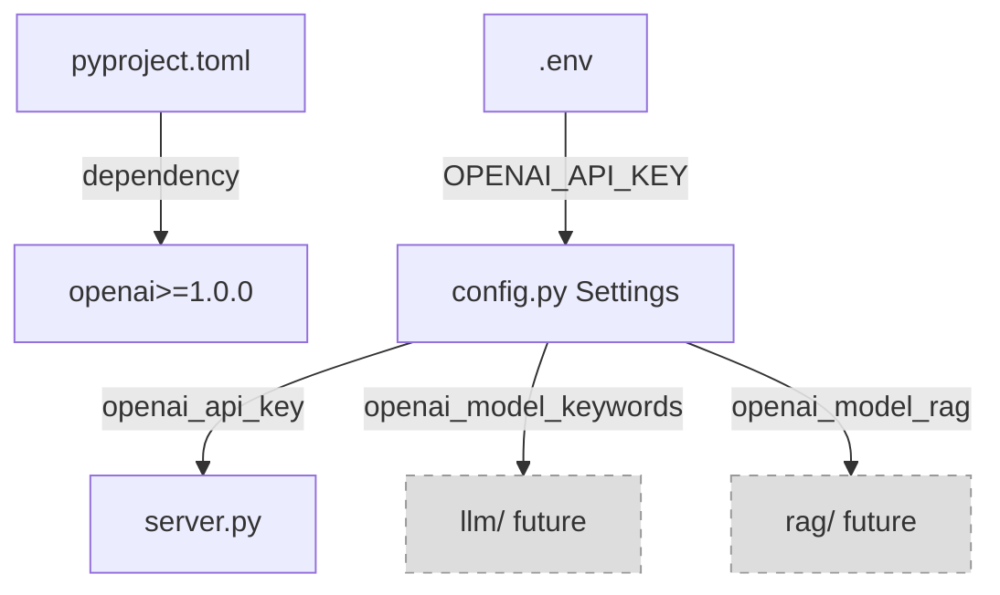

# Plan de Trabajo: Task-03 - Migración de Anthropic Claude a OpenAI

**Fecha de Creación**: 2025-12-29
**Versión**: 1.0
**Estado**: Pendiente de Aprobación
**Autor**: Claude Code
**Stack**: MCP (stdio) + ChromaDB (embedded) + OpenAI API + sentence-transformers + httpx + Selenium + PyMuPDF

---

## Historial de Revisiones

| Versión | Fecha | Cambios | Motivo |
|---------|-------|---------|--------|
| 1.0 | 2025-12-29 | Plan inicial | Creación del workplan para migración a OpenAI |

---

## 1. Resumen Ejecutivo

### Descripción General

Esta tarea consiste en migrar la configuración del proyecto de **Anthropic Claude** a **OpenAI GPT-4o-mini** para reducir costos de operación. Actualmente, el proyecto está configurado para usar Claude Haiku 4.5 y Claude Sonnet 4.5, pero **NO hay código de integración implementado todavía** (módulos `llm/` y `rag/` están vacíos).

Esta es una **tarea de configuración preparatoria** que actualiza:
- Dependencias en `pyproject.toml`
- Configuración de modelos en `config.py`
- Variables de entorno en `.env.example`
- Warnings y mensajes del sistema

**Beneficio principal**: Preparar el proyecto para usar GPT-4o-mini, que es **15x más barato** que Claude Haiku 4.5:
- Claude Haiku 4.5: $1.00/$5.00 por 1M tokens
- GPT-4o-mini: $0.15/$0.60 por 1M tokens

### Alcance y Objetivos

**Objetivo Principal**: Reemplazar toda referencia a Anthropic Claude por OpenAI GPT-4o-mini en la configuración del proyecto.

**Componentes del sistema MCP afectados**:
- ✅ Config Management (`config.py`)
- ✅ MCP Server (`server.py`)
- ✅ Dependencies (`pyproject.toml`)
- ✅ Environment (`env.example`)
- ❌ LLM Integration (NO implementado aún - fuera de alcance)
- ❌ RAG System (NO implementado aún - fuera de alcance)

**Referencia a fase del MCP_PLAN.md**:
- Esta tarea es **preparatoria** para Fases 3 (Keyword Generation) y 7 (RAG Q&A)
- NO implementa funcionalidad, solo actualiza configuración

### Estimación de Tiempo

**Total estimado**: 1-2 horas

- Actualizar configuración: 30min
- Actualizar documentación: 30min
- Testing manual: 30min
- Buffer: 30min

---

## 2. Priorización del Alcance

### 🔴 MVP/CORE (Obligatorio)

**Criterio de éxito**: Proyecto arranca sin errores, configuración de OpenAI lista para implementación futura.

Funcionalidades core:
- [x] Reemplazar dependencia `anthropic` por `openai` en pyproject.toml
- [x] Actualizar campos de configuración en config.py
- [x] Actualizar .env.example con OPENAI_API_KEY
- [x] Actualizar warning en server.py
- [x] Verificar que MCP server arranca sin errores

**Componentes MVP**:
- `pyproject.toml`
- `src/sortgs_mcp/config.py`
- `src/sortgs_mcp/server.py`
- `.env.example`

### 🟡 Enhanced (Si hay tiempo)

Funcionalidades que agregan valor pero no bloquean:
- [ ] Actualizar CLAUDE.md con referencias a OpenAI
- [ ] Actualizar MCP_PLAN.md con nuevos modelos
- [ ] Agregar comentarios de migración futura en llm/__init__.py
- [ ] Crear ejemplo de uso de OpenAI en comments

**Componentes Enhanced**:
- `CLAUDE.md`
- `MCP_PLAN.md`
- Comentarios en código

### 🟢 Nice-to-Have (Futuras iteraciones)

Para versiones posteriores:
- [ ] Implementar llm/openai.py con AsyncOpenAI client
- [ ] Implementar keywords.py con prompts para OpenAI
- [ ] Tests unitarios de configuración
- [ ] Script de validación de API keys

**Justificación postponer**: Fase 3 del MCP_PLAN.md no está en scope de esta tarea. Solo preparamos configuración.

### Plan de Reducción de Alcance

**Si se excede el tiempo estimado:**

1. **Recorte Nivel 1**: Eliminar Enhanced completo → Ahorro: 30min
2. **Recorte Nivel 2**: Solo cambios críticos (pyproject.toml + config.py) → Ahorro: 1h
3. **Core absoluto inamovible**: pyproject.toml, config.py, .env.example deben cambiar

---

## 3. Diseño Técnico

### Arquitectura Propuesta

**Cambio de alto nivel**: Reemplazar stack de LLM de Anthropic → OpenAI

```
Antes:
  anthropic>=0.75.0
  ├── AsyncAnthropic client
  ├── claude-haiku-4-5-20250110 (keywords)
  └── claude-sonnet-4-5-20250929 (RAG)

Después:
  openai>=1.0.0
  ├── AsyncOpenAI client
  ├── gpt-4o-mini (keywords)
  └── gpt-4o-mini (RAG)
```

**Componentes afectados**:
- ✅ Config: `src/sortgs_mcp/config.py` (pydantic-settings)
- ✅ Dependencies: `pyproject.toml`
- ✅ MCP Server: `src/sortgs_mcp/server.py` (warning message)
- ✅ Environment: `.env.example`
- ❌ LLM Integration: NO implementado (fuera de alcance)
- ❌ RAG System: NO implementado (fuera de alcance)

### Diagrama de Componentes



### Consideraciones Específicas de MCP + RAG

**MCP Tools Affected**:
- [ ] ¿Requiere nuevos tools? **NO**
- [ ] ¿Cambios en tool schemas? **NO**
- [ ] ¿Cambios en MCP server entry point? **SÍ** (solo warning message)

**Google Scholar Scraping**:
- [ ] ¿Afecta lógica de scraping? **NO**
- [ ] ¿Cambios en parsing HTML? **NO**
- [ ] ¿Requiere manejo de CAPTCHA? **NO**
- [ ] ¿Cambios en rate limiting? **NO**

**Chunking Strategy**:
- [ ] ¿Afecta chunking? **NO**

**Embeddings**:
- [ ] ¿Cambios en embeddings? **NO** (sigue siendo sentence-transformers local)

**Retrieval**:
- [ ] ¿Cambios en retrieval? **NO**

**Prompt Engineering**:
- [ ] ¿Cambios en prompts? **NO** (no hay prompts implementados todavía)

**ChromaDB Collections**:
- [ ] ¿Cambios en collections? **NO**

**PDF Processing**:
- [ ] ¿Cambios en PDF download? **NO**
- [ ] ¿Cambios en PDF parsing? **NO**

### Decisiones de Arquitectura MCP

**MCP Server Design**:
- [x] ¿Cambios en server.py? **SÍ** - Solo actualizar warning message
- Transport: stdio (sin cambios)
- Logging: FileHandler + StreamHandler (sin cambios)

**Tool Design**:
- [ ] ¿Tool es síncrono o asíncrono? **N/A** (no hay nuevos tools)
- [ ] ¿Requiere estado global? **NO**
- [ ] ¿Timeout considerado? **NO**

**Error Handling**:
- [x] Mensajes user-friendly: Actualizar warning de API key
- [ ] Graceful degradation: Sin cambios
- [ ] Logging apropiado: Sin cambios

**Testing Strategy**:
- [x] MCP Inspector testing: Verificar server arranca
- [ ] Claude Code integration testing: Verificar no hay errores
- [ ] Unit tests con mocks: Postponed (Enhanced)

### Decisiones Técnicas KISS

**¿Se reutilizan patrones existentes?**
- ✅ SÍ - Mantenemos la misma estructura de configuración con pydantic-settings
- ✅ SÍ - Solo cambiamos nombres de variables, no arquitectura

**¿Se evita sobre-ingeniería?**
- ✅ SÍ - No implementamos código de LLM en esta tarea
- ✅ SÍ - Solo actualizamos configuración necesaria

**¿Solución más simple posible?**
- ✅ SÍ - Find & replace de "anthropic" → "openai" y "claude" → "gpt-4o-mini"
- ✅ SÍ - Cero lógica nueva, solo configuración

---

## 4. Plan de Desarrollo

### Tareas ordenadas por prioridad y dependencia

| ID | Prioridad | Tarea | Criterios de Aceptación | Dependencias | Esfuerzo |
|----|-----------|-------|-------------------------|--------------|----------|
| T1 | 🔴 CORE | Actualizar pyproject.toml | Dependencia `openai>=1.0.0` añadida, `anthropic` eliminada | - | 5min |
| T2 | 🔴 CORE | Actualizar config.py - API key field | `anthropic_api_key` → `openai_api_key` | T1 | 5min |
| T3 | 🔴 CORE | Actualizar config.py - Model fields | `claude_model_*` → `openai_model_*` con defaults gpt-4o-mini | T2 | 10min |
| T4 | 🔴 CORE | Actualizar config.py - Field descriptions | Descriptions mencionan OpenAI en vez de Claude | T3 | 5min |
| T5 | 🔴 CORE | Actualizar server.py warning | Warning dice "OPENAI_API_KEY not set - LLM-based tools will not work" | T2 | 5min |
| T6 | 🔴 CORE | Actualizar .env.example | OPENAI_API_KEY en vez de ANTHROPIC_API_KEY, modelos actualizados | T3 | 5min |
| T7 | 🔴 CORE | Testing: MCP server arranca | `python -m sortgs_mcp.server` arranca sin errores | T1-T6 | 10min |
| T8 | 🔴 CORE | Testing: MCP Inspector | `mcp inspect` muestra server sin errores | T7 | 10min |
| T9 | 🟡 Enhanced | Actualizar CLAUDE.md | Referencias a OpenAI en lugar de Anthropic | T1-T6 | 15min |
| T10 | 🟡 Enhanced | Actualizar MCP_PLAN.md | Sección de stack tecnológico actualizada | T9 | 15min |

**Orden de implementación sugerido**: T1 → T2 → T3 → T4 → T5 → T6 → T7 → T8 → [T9 → T10 si hay tiempo]

**Total tiempo core**: ~55min
**Total tiempo con enhanced**: ~1h 25min

---

## 5. Plan de Pruebas

### Estrategia de Testing

- **Unit tests**: NO (postponed - configuración no requiere tests complejos)
- **Integration tests**: NO (no hay integración con OpenAI implementada todavía)
- **Manual testing**: SÍ - Smoke test checklist para verificar server arranca

### Casos de Prueba Principales

**Config Loading**:
- [ ] Settings se cargan correctamente desde .env
- [ ] Defaults de modelos son gpt-4o-mini
- [ ] API key opcional (puede ser None)

**MCP Server**:
- [ ] Server arranca sin errores con OPENAI_API_KEY
- [ ] Server arranca con warning si no hay OPENAI_API_KEY
- [ ] MCP Inspector conecta correctamente

**Backwards Compatibility**:
- [ ] Search_papers tool funciona (no usa LLM)
- [ ] Session management funciona
- [ ] No hay imports rotos de anthropic

### Criterios de Calidad

- Server arranca sin errores: ✅ OBLIGATORIO
- Warning claro cuando falta API key: ✅ OBLIGATORIO
- No hay imports de anthropic: ✅ OBLIGATORIO

---

## 6. Smoke Test Checklist

```markdown
**SMOKE TEST CHECKLIST - Task-03 (Migración OpenAI)**

**Ejecutado por**: [Nombre]
**Fecha**: [YYYY-MM-DD]
**Ambiente**: Local Development
**MCP Server**: sortgs-mcp

---

### 1. Dependencias

- [ ] **1.1** `pyproject.toml` contiene `openai>=1.0.0`
- [ ] **1.2** `pyproject.toml` NO contiene `anthropic`
- [ ] **1.3** `uv sync` o `pip install -e .` funciona sin errores

**Comando para verificar**:
```bash
grep -E "openai|anthropic" pyproject.toml
```

---

### 2. Configuración (config.py)

- [ ] **2.1** Campo `openai_api_key` existe (no `anthropic_api_key`)
- [ ] **2.2** Campo `openai_model_keywords` existe con default "gpt-4o-mini"
- [ ] **2.3** Campo `openai_model_rag` existe con default "gpt-4o-mini"
- [ ] **2.4** Descriptions mencionan "OpenAI" en lugar de "Anthropic" o "Claude"

**Comando para verificar**:
```bash
grep -i "anthropic\|claude" src/sortgs_mcp/config.py
# Debería devolver 0 resultados
```

---

### 3. Variables de Entorno (.env.example)

- [ ] **3.1** Contiene `OPENAI_API_KEY=your_openai_api_key_here`
- [ ] **3.2** NO contiene `ANTHROPIC_API_KEY`
- [ ] **3.3** Comentarios mencionan OpenAI models correctamente

**Comando para verificar**:
```bash
cat .env.example
```

---

### 4. MCP Server (server.py)

- [ ] **4.1** Warning message menciona "OPENAI_API_KEY" (no "ANTHROPIC_API_KEY")
- [ ] **4.2** Server arranca sin errores: `python -m sortgs_mcp.server`
- [ ] **4.3** Warning aparece si no hay OPENAI_API_KEY en .env
- [ ] **4.4** NO hay imports de `anthropic` en el código

**Comando para verificar imports**:
```bash
grep -r "from anthropic\|import anthropic" src/sortgs_mcp/
# Debería devolver 0 resultados
```

---

### 5. MCP Inspector

- [ ] **5.1** `mcp inspect python -m sortgs_mcp.server` conecta sin errores
- [ ] **5.2** Tools listados correctamente (search_papers visible)
- [ ] **5.3** No hay errores de módulos faltantes

**Screenshot requerido**: MCP Inspector conectado exitosamente
![Adjuntar aquí]

---

### 6. Funcionalidad Básica

- [ ] **6.1** `search_papers` tool funciona (no requiere LLM)
- [ ] **6.2** Session se crea correctamente
- [ ] **6.3** No hay errores de importación en runtime

**Test básico**:
```bash
# Desde Claude Code o MCP Inspector, invocar:
# search_papers(keywords="machine learning", num_results=10, debug=True)
```

---

### 7. Documentation (Enhanced - opcional)

- [ ] **7.1** CLAUDE.md actualizado con referencias a OpenAI
- [ ] **7.2** MCP_PLAN.md actualizado con nuevos modelos
- [ ] **7.3** README menciona OpenAI en lugar de Anthropic (si aplica)

---

### 8. Code Quality

- [ ] **8.1** No hay referencias a "anthropic" en código (excepto en comments de migración)
- [ ] **8.2** No hay referencias a "claude" en configuración activa
- [ ] **8.3** Type hints correctos en config.py
- [ ] **8.4** Docstrings actualizados

---

**RESULTADO FINAL**

- [ ] ✅ **TODOS LOS TESTS CORE PASAN** (1.1-6.3) - Ready para merge
- [ ] ⚠️ **HAY ISSUES MENORES** - Documentar en PR
- [ ] ❌ **HAY ISSUES BLOQUEANTES** - No crear PR

**Notas adicionales**:
[Agregar observaciones]

---
```

---

## 7. Riesgos y Mitigaciones

| Riesgo | Probabilidad | Impacto | Mitigación |
|--------|--------------|---------|------------|
| Imports rotos de anthropic en código no detectado | Baja | Alto | `grep -r` exhaustivo antes de commit |
| .env.example desactualizado rompe onboarding | Media | Medio | Revisar manualmente, incluir en smoke test |
| Warning message confuso para usuarios | Baja | Bajo | Usar mensaje claro y consistente |
| Olvidar actualizar documentación | Media | Bajo | Incluir en Enhanced tasks |

---

## 8. Plan de Contingencia

### Punto de Decisión GO/NO-GO

- **Cuándo**: Después de T6 (antes de testing)
- **Verificar**: Todos los cambios de configuración completos
- **Si no se cumple**: Revisar tareas T1-T6 antes de continuar

### Escenarios de bloqueo comunes

1. **Server no arranca después de cambios**:
   - → Revisar imports, verificar syntax errors
   - → Rollback a versión anterior y hacer cambios incrementales

2. **MCP Inspector no conecta**:
   - → Verificar que stdio transport no cambió
   - → Revisar logs en stderr

3. **Dependencia openai no se instala**:
   - → Verificar versión Python >=3.10
   - → Limpiar cache de pip/uv y reinstalar

4. **Confusión con nombres de modelos**:
   - → Consultar [OpenAI Models Documentation](https://platform.openai.com/docs/models)
   - → Usar gpt-4o-mini (verificado en documentación oficial)

---

## 10. Decisiones Técnicas TOMADAS

### 10.1 Modelo OpenAI a Usar

**Decisión TOMADA**: `gpt-4o-mini` para ambos usos (keywords y RAG)

**Justificación**:
- ✅ Más económico: $0.15/$0.60 vs $1.00/$5.00 (Claude Haiku) - **15x más barato**
- ✅ Suficientemente capaz para ambas tareas
- ✅ Misma API para ambos (simplifica código futuro)
- ✅ Bien documentado y estable

**Alternativas consideradas**:
- **gpt-4o** ($2.50/$10): Pro: Mejor calidad, Contra: 16x más caro que gpt-4o-mini
- **gpt-3.5-turbo**: Pro: Aún más barato, Contra: Deprecated, peor calidad

**Trade-off aceptado**: Sacrificamos algo de calidad vs gpt-4o para máximo ahorro de costos

**Principio KISS aplicado**: Un solo modelo para todo es más simple que configurar diferentes modelos por uso

**Plan de migración futura**: Si la calidad de keywords es insuficiente, cambiar `openai_model_keywords` → `gpt-4o` (solo ese campo)

---

### 10.2 Estrategia de Naming

**Decisión TOMADA**: Usar `openai_*` como prefijo en lugar de `gpt_*`

**Justificación**:
- ✅ Consistente con patrón anterior (`anthropic_*`, `claude_*`)
- ✅ Independiente del modelo específico (gpt-4o-mini hoy, otro mañana)
- ✅ Claro en el origen del servicio (OpenAI API)

**Alternativas consideradas**:
- **gpt_model_keywords**: Pro: Más corto, Contra: Acoplado al modelo específico
- **llm_model_keywords**: Pro: Genérico, Contra: Menos claro

**Trade-off aceptado**: Nombres un poco más largos por claridad

**Principio KISS aplicado**: Seguir el patrón existente es más simple que inventar uno nuevo

---

### 10.3 Dependencias: Reemplazar vs Agregar

**Decisión TOMADA**: **REEMPLAZAR** `anthropic` por `openai` en pyproject.toml

**Justificación**:
- ✅ No hay código de Anthropic implementado (llm/ y rag/ vacíos)
- ✅ Reduce dependencias innecesarias
- ✅ Evita confusión sobre qué API usar

**Alternativas consideradas**:
- **Mantener ambas**: Pro: Flexibilidad, Contra: Dependencia extra innecesaria
- **Agregar openai sin quitar anthropic**: Pro: Safe, Contra: Waste de espacio

**Trade-off aceptado**: No hay fallback a Anthropic si OpenAI falla (aceptable porque no hay código implementado)

**Principio KISS aplicado**: Menos dependencias = más simple

---

### 10.4 Actualizar Documentación en esta Tarea

**Decisión TOMADA**: **OPCIONAL (Enhanced)** - Core solo cambia configuración

**Justificación**:
- ✅ Documentación puede actualizarse después sin romper nada
- ✅ Core es funcional sin docs (server arranca)
- ✅ Permite iterar rápido en configuración

**Alternativas consideradas**:
- **Docs obligatorias en Core**: Pro: Completo, Contra: Overhead para tarea simple
- **No actualizar docs nunca**: Contra: Inconsistencia a largo plazo

**Trade-off aceptado**: Docs temporalmente desactualizadas hasta Enhanced

**Principio KISS aplicado**: Hacer funcionar el código primero, documentar después

---

## 11. Apéndices

### Referencias

- [OpenAI Python SDK](https://github.com/openai/openai-python)
- [OpenAI API Documentation](https://platform.openai.com/docs/api-reference/introduction)
- [GPT-4o-mini Model](https://platform.openai.com/docs/models/gpt-4o-mini)
- [OpenAI Pricing](https://openai.com/api/pricing/)
- [AsyncOpenAI Usage](https://platform.openai.com/docs/api-reference/async-client)

### Comparación de Precios (Anthropic vs OpenAI)

| Caso de Uso | Claude Haiku 4.5 | GPT-4o-mini | Ahorro |
|-------------|------------------|-------------|--------|
| **Input** (1M tokens) | $1.00 | $0.15 | **85%** |
| **Output** (1M tokens) | $5.00 | $0.60 | **88%** |
| **Keyword generation** (típico: 200 in, 50 out) | $0.00045 | $0.00006 | **87%** |
| **RAG query** (típico: 3k in, 500 out) | $0.0165 | $0.00075 | **95%** |

**Proyección mensual** (uso moderado: 50 keywords + 200 queries):
- Claude: ~$3.50/mes
- OpenAI: ~$0.18/mes
- **Ahorro: $3.32/mes (95%)**

### Glosario

- **gpt-4o-mini**: Modelo más económico de OpenAI basado en GPT-4, optimizado para velocidad y costo
- **AsyncOpenAI**: Cliente asíncrono de OpenAI para uso con asyncio/httpx
- **MCP (Model Context Protocol)**: Protocolo para integración de herramientas con Claude Code

---

## Próximos Pasos Después de Esta Tarea

Esta tarea solo prepara configuración. Para implementar LLM integration:

1. **Fase 3 del MCP_PLAN.md** - Implementar keyword generation con OpenAI:
   - Crear `src/sortgs_mcp/llm/openai.py` con `OpenAIClient` class
   - Crear `src/sortgs_mcp/llm/keywords.py` con prompts
   - Crear tool `generate_search_keywords`

2. **Fase 7 del MCP_PLAN.md** - Implementar RAG Q&A con OpenAI:
   - Actualizar `OpenAIClient.generate_answer()` method
   - Crear `src/sortgs_mcp/rag/retriever.py` con RAG pipeline
   - Crear tool `query_papers`

**Esta tarea NO implementa esas fases**, solo prepara el terreno actualizando configuración.

---

**FIN DEL WORKPLAN**
