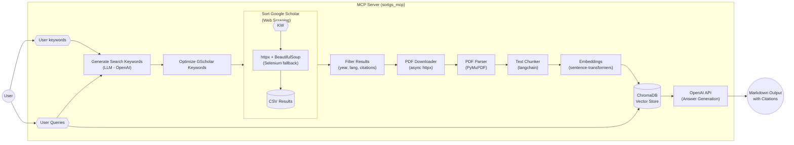

# SORT GOOGLE SCHOLAR MCP

**Proyecto Original:** https://github.com/WittmannF/sort-google-scholar

## 🎯 Visión del Proyecto

Transformar sort-google-scholar en un **MCP Server con capacidades RAG** que permita a agentes de IA:

1. 🔍 **Generar keywords** de búsqueda optimizadas usando LLM
2. 📚 **Buscar papers** en Google Scholar con filtros avanzados
3. 📥 **Descargar PDFs** de los papers encontrados
4. 🗂️ **Indexar contenido** con embeddings en vector database local
5. 💬 **Responder preguntas** sobre los papers usando RAG (Retrieval-Augmented Generation)

## 🏗️ Arquitectura Conceptual



## ✅ Factibilidad

**ESTADO:** ✅ **VIABLE** con arquitectura local-first

**Estimación:** 40-60 horas de desarrollo

**MVP:** 25-30 horas (sin keyword generation LLM)

## 📋 Características del Nuevo Proyecto

### 🆕 Nuevas Capacidades

| Característica | Descripción | Beneficio |
|----------------|-------------|-----------|
| **MCP Server** | Servidor stdio compatible con Claude Code | Integración directa con agentes de IA |
| **Keyword Generation** | LLM genera variaciones de búsqueda | Búsquedas más completas y relevantes |
| **PDF Download** | Descarga automática de PDFs | Acceso al contenido completo |
| **RAG System** | Indexación + Q&A sobre papers | Responde preguntas sobre investigación |
| **Async Operations** | Operaciones asíncronas | Mayor performance y concurrencia |
| **Type Safety** | Pydantic models | Validación y documentación automática |
| **Session Management** | Gestión de búsquedas históricas | Organización y reutilización |

### 🔧 Stack Tecnológico

| Componente | Tecnología | Justificación |
|------------|-----------|---------------|
| **MCP Framework** | `mcp` SDK oficial (v1.2+) | Stdio server para Claude Code |
| **Async HTTP** | `httpx` | Reemplazo async de requests |
| **Browser Automation** | `selenium` (mantener) | Fallback para CAPTCHA (no async viable) |
| **LLM** | OpenAI API | Keyword generation + RAG QA |
| **Vector DB** | ChromaDB (embedded) | Sin servidor, persistente, 100% local |
| **Embeddings** | sentence-transformers | Local, sin API, modelo all-mpnet-base-v2 |
| **PDF Parsing** | PyMuPDF (fitz) | Rápido, robusto para papers académicos |
| **Text Chunking** | langchain text splitters | RecursiveCharacterTextSplitter |
| **Type Validation** | pydantic v2 | Models + settings management |
| **Retry Logic** | tenacity | Exponential backoff para APIs |

### 📦 Estructura del Proyecto

```
sort-google-scholar-mcp/
├── src/
│   ├── sortgs/                    # ✅ Original (backward compat)
│   │   ├── __init__.py
│   │   └── sortgs.py
│   │
│   └── sortgs_mcp/                # ✨ Nuevo paquete MCP
│       ├── __init__.py
│       ├── server.py              # MCP server entry point
│       ├── config.py              # Pydantic settings
│       ├── models.py              # Data models (Paper, SearchParams, Session)
│       │
│       ├── core/                  # Refactored scraping
│       │   ├── __init__.py
│       │   ├── scholar.py         # ScholarSearcher class (async)
│       │   ├── parser.py          # HTML parsing utils
│       │   └── session.py         # SessionManager (JSON storage)
│       │
│       ├── llm/                   # LLM integration
│       │   ├── __init__.py
│       │   ├── openai.py          # Async OpenAI client
│       │   └── keywords.py        # Keyword generation
│       │
│       ├── pdf/                   # PDF processing
│       │   ├── __init__.py
│       │   ├── downloader.py      # Async downloader
│       │   ├── parser.py          # PyMuPDF extraction
│       │   └── chunker.py         # Text chunking
│       │
│       ├── rag/                   # RAG system
│       │   ├── __init__.py
│       │   ├── vectorstore.py     # ChromaDB wrapper
│       │   ├── embeddings.py      # sentence-transformers
│       │   └── retriever.py       # Query + answer generation
│       │
│       └── tools/                 # MCP tool implementations
│           ├── __init__.py
│           ├── search.py          # generate_keywords, search_papers
│           ├── download.py        # download_papers
│           ├── index.py           # index_papers
│           └── query.py           # query_papers, list_sessions
│
├── data/                          # ⚠️ Gitignored storage
│   ├── sessions/                  # Por búsqueda
│   │   └── {session_id}/
│   │       ├── metadata.json
│   │       ├── results.csv
│   │       └── pdfs/
│   └── vectorstore/               # ChromaDB persist
│
├── tests/
│   ├── test_sortgs.py            # ✅ Existing
│   ├── test_mcp_tools.py         # ✨ New
│   ├── test_rag.py               # ✨ New
│   └── fixtures/
│       └── sample.pdf
│
├── .env.example                   # OPENAI_API_KEY
├── pyproject.toml                 # Updated deps
└── README.md                      # Updated docs
```

## 🔧 MCP Tools Expuestos

El servidor MCP expondrá **6 herramientas** que los agentes de IA pueden invocar:

### 1. `generate_search_keywords`

**Descripción:** Genera variaciones de keywords optimizadas para Google Scholar usando OpenAI API.

**Input:**
```json
{
  "query": "papers about transformers in NLP",
  "num_variations": 3
}
```

**Output:**
```json
{
  "keywords": [
    "transformers neural networks natural language processing",
    "attention mechanism BERT GPT language models",
    "sequence-to-sequence models deep learning NLP"
  ]
}
```

**Caso de uso:** Usuario quiere explorar un tema → LLM genera múltiples ángulos de búsqueda.

---

### 2. `search_papers`

**Descripción:** Busca papers en Google Scholar con filtros y devuelve sesión con resultados.

**Input:**
```json
{
  "keywords": "transformers attention mechanism",
  "num_results": 100,
  "sort_by": "cit/year",
  "start_year": 2017,
  "end_year": 2024,
  "languages": ["en"]
}
```

**Output:**
```json
{
  "session_id": "550e8400-e29b-41d4-a716-446655440000",
  "papers_found": 98,
  "top_5_titles": [
    "Attention Is All You Need",
    "BERT: Pre-training of Deep Bidirectional Transformers...",
    "..."
  ],
  "csv_path": "data/sessions/{id}/results.csv"
}
```

**Caso de uso:** Ejecutar búsqueda en Google Scholar y guardar sesión.

---

### 3. `download_papers`

**Descripción:** Descarga PDFs de los papers encontrados en una sesión.

**Input:**
```json
{
  "session_id": "550e8400...",
  "paper_indices": [0, 1, 2, 5, 8],  // Vacío = todos con PDF
  "max_papers": 10
}
```

**Output:**
```json
{
  "downloaded": 8,
  "failed": 2,
  "pdf_paths": [
    "data/sessions/{id}/pdfs/paper_0.pdf",
    "..."
  ],
  "failed_papers": [
    {"rank": 3, "title": "...", "reason": "403 Forbidden"},
    {"rank": 7, "title": "...", "reason": "PDF not available"}
  ]
}
```

**Caso de uso:** Obtener PDFs completos de papers relevantes.

---

### 4. `index_papers`

**Descripción:** Parsea PDFs descargados, genera chunks y embeddings, indexa en ChromaDB.

**Input:**
```json
{
  "session_id": "550e8400...",
  "chunk_size": 1000,
  "chunk_overlap": 200
}
```

**Output:**
```json
{
  "papers_indexed": 8,
  "chunks_created": 342,
  "indexing_time_sec": 45.3,
  "failed_papers": ["Paper with corrupted PDF"]
}
```

**Caso de uso:** Preparar papers para RAG query.

---

### 5. `query_papers`

**Descripción:** Responde preguntas sobre papers indexados usando RAG.

**Input:**
```json
{
  "question": "What are the main innovations in the Transformer architecture?",
  "session_id": "550e8400...",  // Opcional: busca en todas las sesiones si se omite
  "top_k": 5
}
```

**Output:**
```json
{
  "question": "What are the main innovations in the Transformer architecture?",
  "answer": "The main innovations in the Transformer architecture are:\n\n1. **Self-Attention Mechanism**: Replaces recurrence with attention, allowing parallel processing...\n2. **Multi-Head Attention**: Uses multiple attention mechanisms in parallel...\n3. **Positional Encoding**: Injects sequence order information...\n\nSources: Vaswani et al. (2017), Devlin et al. (2018)",
  "sources": [
    {
      "paper_title": "Attention Is All You Need",
      "chunk_text": "The Transformer model architecture relies entirely on self-attention mechanisms...",
      "relevance_score": 0.89,
      "metadata": {"page": 3, "authors": "Vaswani et al.", "year": 2017}
    },
    ...
  ]
}
```

**Caso de uso:** Hacer preguntas sobre la investigación y obtener respuestas con citas.

---

### 6. `list_sessions`

**Descripción:** Lista todas las sesiones de búsqueda guardadas.

**Input:**
```json
{}
```

**Output:**
```json
{
  "sessions": [
    {
      "session_id": "550e8400...",
      "keywords": "transformers attention",
      "created_at": "2025-01-15T10:30:00",
      "papers_count": 98,
      "pdfs_downloaded": 8,
      "indexed": true
    },
    {
      "session_id": "660f9511...",
      "keywords": "graph neural networks",
      "created_at": "2025-01-14T15:20:00",
      "papers_count": 75,
      "pdfs_downloaded": 0,
      "indexed": false
    }
  ]
}
```

**Caso de uso:** Ver historial de búsquedas y estado de cada sesión.

## 🚀 Fases de Desarrollo

### Resumen de Fases

| Fase | Nombre | Duración | Prioridad | Dependencias |
|------|--------|----------|-----------|--------------|
| 0 | Setup | 2-3h | 🔴 Crítica | Ninguna |
| 1 | Core Refactoring | 6-8h | 🔴 Crítica | Fase 0 |
| 2 | MCP Server Skeleton | 3-4h | 🔴 Crítica | Fases 0, 1 |
| 3 | LLM Keyword Generation | 4-5h | 🟡 Alta | Fases 0, 1 |
| 4 | PDF Download | 4-5h | 🔴 Crítica | Fases 0, 1, 2 |
| 5 | PDF Parsing | 3-4h | 🔴 Crítica | Fase 4 |
| 6 | RAG Vector Store | 5-6h | 🔴 Crítica | Fases 0, 1, 5 |
| 7 | RAG Question Answering | 5-6h | 🔴 Crítica | Fases 0, 1, 3, 6 |
| 8 | Testing | 6-8h | 🟡 Alta | Todas |
| 9 | Docs & Polish | 4-5h | 🟢 Media | Todas |

**Total:** 42-54 horas

---

### **FASE 0: Setup del Proyecto**
⏱️ **Duración:** 2-3 horas
🎯 **Objetivo:** Configurar infraestructura base del proyecto

#### Tareas

##### 1. Actualizar `pyproject.toml`
- [ ] Añadir dependencias MCP:
  - `mcp>=1.2.0`
  - `openai`
  - `httpx`
  - `pydantic>=2.0`
  - `pydantic-settings`
  - `aiofiles`
  - `tenacity`
- [ ] Añadir dependencias RAG:
  - `chromadb`
  - `sentence-transformers`
  - `pymupdf`
  - `langchain-text-splitters`
- [ ] Añadir entry point: `sortgs-mcp = sortgs_mcp.server:main`
- [ ] Mantener entry point original: `sortgs = sortgs:main`

##### 2. Crear estructura de directorios
```bash
mkdir -p src/sortgs_mcp/{core,llm,pdf,rag,tools}
mkdir -p data/{sessions,vectorstore}
mkdir -p tests/fixtures
```

##### 3. Crear `src/sortgs_mcp/config.py`
- [ ] Clase `Settings` con pydantic-settings
- [ ] Campo `openai_api_key` (requerido)
- [ ] Campos `data_dir`, `sessions_dir`, `chroma_persist_dir` (paths)
- [ ] Campos de configuración: `embedding_model`, `openai_model_keywords`, `openai_model_rag`
- [ ] Configuración PDF: `max_concurrent_downloads`, `chunk_size`, `chunk_overlap`
- [ ] `log_level` configurable
- [ ] Método `model_post_init` para crear directorios automáticamente
- [ ] Instancia global `settings`

##### 4. Crear `.env.example`
```bash
# OpenAI API Configuration
OPENAI_API_KEY=your_api_key_here

# Optional overrides
# DATA_DIR=./data
# EMBEDDING_MODEL=all-mpnet-base-v2
# ...
```

##### 5. Actualizar `.gitignore`
- [ ] Añadir `data/` (almacenamiento local)
- [ ] Añadir `*.pdf` (PDFs descargados)
- [ ] Verificar `.env` ya está ignorado

##### 6. Crear `__init__.py` en todos los submódulos
```bash
touch src/sortgs_mcp/__init__.py
touch src/sortgs_mcp/{core,llm,pdf,rag,tools}/__init__.py
```

**Entregables:**
- ✅ Estructura de directorios completa
- ✅ Dependencias actualizadas
- ✅ Sistema de configuración funcional
- ✅ `.env.example` documentado

---

### **FASE 1: Core Refactoring**
⏱️ **Duración:** 6-8 horas
🎯 **Objetivo:** Extraer y modernizar lógica de scraping de `sortgs.py`

#### Tareas

##### 1. Crear `src/sortgs_mcp/models.py`
- [ ] Modelo `Paper`:
  - Campos: rank, title, authors, citations, year, publisher, venue, content_snippet, source_url, pdf_url, cit_per_year
  - Type hints completos
  - Ejemplo en `Config.json_schema_extra`
- [ ] Modelo `SearchParams`:
  - Campos: keywords, num_results, sort_by, start_year, end_year, languages, debug
  - Validaciones con pydantic (ge, le, Literal para sort_by)
  - Defaults sensatos
- [ ] Modelo `SearchSession`:
  - Campos: session_id, created_at, params, papers, papers_count, pdfs_downloaded, indexed
  - `created_at` con `default_factory=datetime.now`
- [ ] Modelos adicionales: `PDFDownloadResult`, `IndexingResult`, `QuerySource`, `QueryResult`

##### 2. Crear `src/sortgs_mcp/core/parser.py`
- [ ] Función `get_citations(content: str) -> int`
  - Regex: `r"Cited by (\d+)"`
  - Return 0 si no match
- [ ] Función `get_year(content: str) -> int`
  - Regex: `r"\b(19|20)\d{2}\b"`
  - Return 0 si no match
- [ ] Función `get_author(content: str) -> str`
  - Clean unicode: `.replace("\xa0", " ")`
  - Split on " - ", tomar primer elemento
- [ ] Función `get_pdf_link(div: Tag) -> str | None`
  - Buscar div con class "gs_ggs gs_fl"
  - Extraer href del <a> tag
  - Return None si no existe
- [ ] Función `parse_google_scholar_page(html_content: bytes) -> list[dict]`
  - BeautifulSoup parse
  - Iterar sobre divs con class "gs_or"
  - Para cada div extraer: title, source_url, citations, year, authors, publisher, venue, content_snippet, pdf_url
  - Return lista de dicts

##### 3. Crear `src/sortgs_mcp/core/scholar.py`
**Clase `ScholarSearcher`:**

- [ ] Método `__init__(self, debug: bool = False)`
  - Inicializar httpx.AsyncClient
  - Configurar headers (User-Agent)
  - Guardar flag de debug

- [ ] Método `build_url(self, params: SearchParams, offset: int = 0) -> str`
  - Base URL: `https://scholar.google.com/scholar?start={offset}&q={keywords}&hl=en&as_sdt=0,5`
  - Añadir `&as_ylo={start_year}` si start_year
  - Añadir `&as_yhi={end_year}` si end_year
  - Añadir `&lr={formatted_langs}` si languages
  - Si debug: wrap con `https://web.archive.org/web/20210314203256/`

- [ ] Método `async def fetch_page(self, url: str) -> bytes`
  - Try: `await self.client.get(url, timeout=30)`
  - Detectar robot check: buscar keywords en content
  - Si robot check → usar `fetch_with_selenium(url)`
  - Random sleep (0.5-3s) después de cada request

- [ ] Método `fetch_with_selenium(self, url: str) -> bytes`
  - Setup Selenium driver si no existe
  - `driver.get(url)`
  - Esperar a body con WebDriverWait
  - Loop: si CAPTCHA → pause for manual solve → continue
  - Return `driver.find_element(By.TAG_NAME, "body").get_attribute("innerHTML").encode()`

- [ ] Método `async def search(self, params: SearchParams) -> list[Paper]`
  - Iterar offset 0, 10, 20, ... hasta num_results
  - Para cada página:
    - `url = self.build_url(params, offset)`
    - `html = await self.fetch_page(url)`
    - `papers_data = parse_google_scholar_page(html)`
    - Convertir cada dict a `Paper` model
    - Calcular `cit_per_year = citations / (end_year + 1 - year)`
    - Añadir rank (incremental)
  - Retornar lista completa de Papers
  - Ordenar por `params.sort_by`

**Notas:**
- Selenium se ejecuta en `asyncio.to_thread()` ya que no es async
- httpx reemplaza requests para operaciones async
- Mantener lógica de fallback idéntica al código original

##### 4. Crear `src/sortgs_mcp/core/session.py`
**Clase `SessionManager`:**

- [ ] Método `__init__(self, data_dir: Path)`
  - Guardar `sessions_dir = data_dir / "sessions"`
  - Crear directorio si no existe

- [ ] Método `create_session(self, params: SearchParams) -> str`
  - Generar UUID: `str(uuid.uuid4())`
  - Crear directorio: `sessions_dir / session_id`
  - Crear subdirectorio: `sessions_dir / session_id / pdfs`
  - Return session_id

- [ ] Método `save_session(self, session: SearchSession) -> None`
  - Path: `sessions_dir / session.session_id`
  - Guardar metadata: `path / "metadata.json"` (pydantic `.model_dump_json()`)
  - Guardar CSV: `path / "results.csv"` (pandas DataFrame from papers)

- [ ] Método `load_session(self, session_id: str) -> SearchSession`
  - Leer `metadata.json`
  - Parsear con `SearchSession.model_validate_json()`
  - Return session

- [ ] Método `list_sessions(self) -> list[dict]`
  - Iterar sobre directorios en `sessions_dir`
  - Para cada uno, cargar metadata.json
  - Return lista de dicts con: session_id, keywords, created_at, papers_count, pdfs_downloaded, indexed

**Entregables:**
- ✅ Modelos pydantic completos con validación
- ✅ Parser HTML extraído y testeado
- ✅ ScholarSearcher async funcional
- ✅ SessionManager con persistencia JSON

---

### **FASE 2: MCP Server Skeleton**
⏱️ **Duración:** 3-4 horas
🎯 **Objetivo:** Servidor MCP funcional con tool básico

#### Tareas

##### 1. Crear `src/sortgs_mcp/server.py`
```python
from mcp.server.fastmcp import FastMCP
import logging

# Setup logging
logging.basicConfig(
    level=logging.INFO,
    format='%(asctime)s - %(name)s - %(levelname)s - %(message)s',
    handlers=[
        logging.FileHandler('sortgs_mcp.log'),
        logging.StreamHandler()
    ]
)

logger = logging.getLogger(__name__)

# Initialize MCP server
mcp = FastMCP("sortgs")

# Tools will be added here with @mcp.tool() decorator

def main():
    """Entry point for MCP server."""
    logger.info("Starting Sort Google Scholar MCP Server")
    mcp.run(transport="stdio")

if __name__ == "__main__":
    main()
```

##### 2. Crear `src/sortgs_mcp/tools/search.py`
**Tool: `search_papers`**

```python
@mcp.tool()
async def search_papers(
    keywords: str,
    num_results: int = 100,
    sort_by: str = "Citations",
    start_year: int | None = None,
    end_year: int | None = None,
    languages: list[str] | None = None
) -> dict:
    """Search Google Scholar for papers and save results in a session.

    Args:
        keywords: Search query keywords
        num_results: Number of results to fetch (10-1000)
        sort_by: Sort by "Citations" or "cit/year"
        start_year: Filter papers from this year onwards
        end_year: Filter papers up to this year
        languages: Language codes (e.g., ["en", "es"])

    Returns:
        Dictionary with session_id, papers_found, top_5_titles, csv_path
    """
    # Implementación:
    # 1. Crear SearchParams
    # 2. SessionManager.create_session()
    # 3. ScholarSearcher.search(params)
    # 4. SessionManager.save_session()
    # 5. Return resumen
```

**Tareas:**
- [ ] Importar dependencias (config, models, ScholarSearcher, SessionManager)
- [ ] Instanciar globals: `settings`, `session_manager`, `scholar_searcher`
- [ ] Implementar lógica del tool
- [ ] Manejo de errores con try/except
- [ ] Logging de cada paso
- [ ] Return dict con formato especificado

##### 3. Integrar tool en `server.py`
- [ ] Import tool: `from sortgs_mcp.tools.search import search_papers`
- [ ] El decorador `@mcp.tool()` registra automáticamente

##### 4. Testing con MCP Inspector
```bash
# Instalar MCP Inspector
npm install -g @modelcontextprotocol/inspector

# Ejecutar inspector
mcp inspect python -m sortgs_mcp.server

# Probar tool search_papers con inputs de ejemplo
```

- [ ] Verificar que tool aparece en inspector
- [ ] Probar con inputs válidos
- [ ] Verificar outputs
- [ ] Verificar que sesión se guarda correctamente

##### 5. Configurar en Claude Code
```bash
claude mcp add \
  --transport stdio \
  sortgs-mcp \
  -- python -m sortgs_mcp.server
```

- [ ] Verificar que aparece en `claude mcp list`
- [ ] Probar invocación desde Claude Code
- [ ] Verificar logs en `sortgs_mcp.log`

**Entregables:**
- ✅ MCP server funcional con stdio transport
- ✅ Tool `search_papers` implementado y testeado
- ✅ Integración con Claude Code verificada
- ✅ Logging funcionando

---

### **FASE 3: LLM Keyword Generation**
⏱️ **Duración:** 4-5 horas
🎯 **Objetivo:** Generación inteligente de keywords con OpenAI API

#### Tareas

##### 1. Crear `src/sortgs_mcp/llm/openai.py`
**Clase `OpenAIClient`:**

```python
from openai import AsyncOpenAI
from tenacity import retry, stop_after_attempt, wait_exponential
import logging

class OpenAIClient:
    def __init__(self, api_key: str, model: str = "gpt-4o-mini"):
        self.client = AsyncOpenAI(api_key=api_key)
        self.model = model
        self.logger = logging.getLogger(__name__)

    @retry(
        stop=stop_after_attempt(3),
        wait=wait_exponential(multiplier=1, min=4, max=10)
    )
    async def generate_keywords(self, query: str, num_variations: int = 3) -> list[str]:
        """Generate keyword variations for Google Scholar search."""
        # Implementar

    @retry(
        stop=stop_after_attempt(3),
        wait=wait_exponential(multiplier=1, min=4, max=10)
    )
    async def generate_answer(self, question: str, context: str) -> str:
        """Generate answer from context using RAG."""
        # Implementar (Fase 7)
```

**Tareas:**
- [ ] Método `generate_keywords`:
  - Construir prompt para keyword generation
  - Llamar OpenAI API: `self.client.responses.create()`
  - Parsear respuesta (lista de keywords)
  - Validar que devuelve `num_variations` keywords
  - Logging de tokens usados

- [ ] Retry logic con tenacity (3 intentos, exponential backoff)
- [ ] Error handling (API errors, parsing errors)
- [ ] Unit tests con mock de OpenAI client

##### 2. Crear `src/sortgs_mcp/llm/keywords.py`
**Prompt template para keyword generation:**

```python
KEYWORD_GENERATION_PROMPT = """You are an expert research assistant specializing in academic literature search.

Given a user's research query, generate {num_variations} optimized keyword variations for Google Scholar search.

User query: "{query}"

Requirements:
- Each variation should approach the topic from a different angle
- Use academic terminology and synonyms
- Include both broad and specific terms
- Optimize for Google Scholar's search algorithm
- Each variation should be 3-8 words

Return ONLY a JSON list of keyword strings, nothing else.

Example output format:
["keyword variation 1", "keyword variation 2", "keyword variation 3"]
"""

def build_keyword_prompt(query: str, num_variations: int) -> str:
    """Build prompt for keyword generation."""
    return KEYWORD_GENERATION_PROMPT.format(
        query=query,
        num_variations=num_variations
    )

def parse_keyword_response(response: str) -> list[str]:
    """Parse OpenAI's response to extract keywords list."""
    import json
    import re

    # Try direct JSON parse
    try:
        keywords = json.loads(response)
        if isinstance(keywords, list):
            return keywords
    except:
        pass

    # Try extracting JSON from markdown code block
    match = re.search(r'```(?:json)?\s*(\[.*?\])\s*```', response, re.DOTALL)
    if match:
        try:
            keywords = json.loads(match.group(1))
            return keywords
        except:
            pass

    # Fallback: extract quoted strings
    keywords = re.findall(r'"([^"]+)"', response)
    return keywords if keywords else [response.strip()]
```

**Tareas:**
- [ ] Crear prompt template
- [ ] Función `build_keyword_prompt`
- [ ] Función `parse_keyword_response` con fallbacks
- [ ] Tests para parsing (casos edge: markdown, JSON malformado)

##### 3. Crear tool `generate_search_keywords`
En `src/sortgs_mcp/tools/search.py`:

```python
@mcp.tool()
async def generate_search_keywords(
    query: str,
    num_variations: int = 3
) -> dict:
    """Generate optimized Google Scholar search keywords using LLM.

    Args:
        query: User's research question or topic
        num_variations: Number of keyword variations to generate (1-5)

    Returns:
        Dictionary with "keywords" list
    """
    from sortgs_mcp.llm.openai import OpenAIClient
    from sortgs_mcp.llm.keywords import build_keyword_prompt, parse_keyword_response
    from sortgs_mcp.config import settings

    client = OpenAIClient(
        api_key=settings.openai_api_key,
        model=settings.openai_model_keywords
    )

    # Generate
    keywords = await client.generate_keywords(query, num_variations)

    return {"keywords": keywords}
```

**Tareas:**
- [ ] Implementar tool
- [ ] Validar inputs (num_variations 1-5)
- [ ] Error handling
- [ ] Logging
- [ ] Testing con MCP Inspector

##### 4. Testing
- [ ] Unit tests para `OpenAIClient` (mock API)
- [ ] Unit tests para prompt building y parsing
- [ ] Integration test con API real (pequeño)
- [ ] Test en MCP Inspector
- [ ] Test en Claude Code

**Entregables:**
- ✅ OpenAIClient con retry logic
- ✅ Sistema de prompts para keywords
- ✅ Tool `generate_search_keywords` funcional
- ✅ Tests unitarios y de integración

---

### **FASE 4: PDF Download**
⏱️ **Duración:** 4-5 horas
🎯 **Objetivo:** Descargar PDFs de papers encontrados

#### Tareas

##### 1. Crear `src/sortgs_mcp/pdf/downloader.py`
**Clase `PDFDownloader`:**

```python
import httpx
import asyncio
from pathlib import Path
from tenacity import retry, stop_after_attempt, wait_exponential
import logging

class PDFDownloader:
    def __init__(self, max_concurrent: int = 5, timeout: int = 30):
        self.max_concurrent = max_concurrent
        self.timeout = timeout
        self.logger = logging.getLogger(__name__)
        self.semaphore = asyncio.Semaphore(max_concurrent)

    @retry(
        stop=stop_after_attempt(3),
        wait=wait_exponential(multiplier=1, min=2, max=10)
    )
    async def download_single(
        self,
        url: str,
        filepath: Path,
        paper_title: str
    ) -> tuple[bool, str | None]:
        """Download a single PDF with retry logic.

        Returns:
            (success: bool, error_message: str | None)
        """
        # Implementar

    async def download_batch(
        self,
        papers: list[Paper],
        session_dir: Path
    ) -> PDFDownloadResult:
        """Download multiple PDFs concurrently."""
        # Implementar
```

**Tareas `download_single`:**
- [ ] Async context manager para semaphore
- [ ] httpx.AsyncClient.get(url, timeout, follow_redirects=True)
- [ ] Verificar Content-Type es PDF (o al menos no HTML)
- [ ] Validar que contenido empieza con `%PDF`
- [ ] Sanitizar filename (paper rank + safe title)
- [ ] Escribir con `aiofiles.open(filepath, 'wb')`
- [ ] Return (True, None) si éxito
- [ ] Catch exceptions → Return (False, error_message)
- [ ] Logging de progreso

**Tareas `download_batch`:**
- [ ] Filtrar papers que tienen `pdf_url is not None`
- [ ] Crear lista de tareas async
- [ ] `asyncio.gather(*tasks, return_exceptions=True)`
- [ ] Trackear downloaded/failed counts
- [ ] Return `PDFDownloadResult` model
- [ ] Progress logging cada 10 papers

##### 2. Crear tool `download_papers`
En `src/sortgs_mcp/tools/download.py`:

```python
@mcp.tool()
async def download_papers(
    session_id: str,
    paper_indices: list[int] | None = None,
    max_papers: int = 10
) -> dict:
    """Download PDFs for papers from a search session.

    Args:
        session_id: Search session ID from search_papers
        paper_indices: Specific paper indices to download (empty = all with PDFs)
        max_papers: Maximum number of PDFs to download

    Returns:
        Download result with counts and paths
    """
    # Implementar:
    # 1. Load session
    # 2. Filter papers (indices + has PDF)
    # 3. Limit to max_papers
    # 4. PDFDownloader.download_batch()
    # 5. Update session metadata (pdfs_downloaded count)
    # 6. Save session
    # 7. Return result dict
```

**Tareas:**
- [ ] Load session con SessionManager
- [ ] Filtrar papers por indices (si provided)
- [ ] Filtrar papers con pdf_url
- [ ] Aplicar max_papers limit
- [ ] Llamar downloader
- [ ] Actualizar session.pdfs_downloaded
- [ ] Save session
- [ ] Error handling
- [ ] Return PDFDownloadResult como dict

##### 3. Testing
- [ ] Unit tests para `download_single` (mock httpx)
  - Test éxito
  - Test error 404
  - Test HTML en lugar de PDF
  - Test timeout
- [ ] Unit tests para `download_batch`
  - Test batch mixto (algunos éxito, algunos fail)
- [ ] Integration test con PDFs reales (fixture URLs)
- [ ] Test tool con MCP Inspector
- [ ] Verificar archivos se guardan correctamente

**Entregables:**
- ✅ PDFDownloader async con concurrency limit
- ✅ Retry logic y error handling robusto
- ✅ Tool `download_papers` funcional
- ✅ Validación de PDFs (content-type, magic bytes)
- ✅ Tests comprehensivos

---

### **FASE 5: PDF Parsing**
⏱️ **Duración:** 3-4 horas
🎯 **Objetivo:** Extraer texto de PDFs y crear chunks

#### Tareas

##### 1. Crear `src/sortgs_mcp/pdf/parser.py`
**Clase `PDFParser`:**

```python
import fitz  # PyMuPDF
from pathlib import Path
import logging

class PDFParser:
    def __init__(self):
        self.logger = logging.getLogger(__name__)

    def extract_text(self, pdf_path: Path) -> str | None:
        """Extract text from PDF using PyMuPDF.

        Returns:
            Extracted text or None if failed
        """
        try:
            doc = fitz.open(pdf_path)
            text_parts = []

            for page_num in range(len(doc)):
                page = doc[page_num]
                text = page.get_text()
                text_parts.append(text)

            doc.close()

            full_text = "\n\n".join(text_parts)
            return full_text if full_text.strip() else None

        except Exception as e:
            self.logger.error(f"Failed to parse {pdf_path}: {e}")
            return None

    def extract_metadata(self, pdf_path: Path) -> dict:
        """Extract PDF metadata."""
        try:
            doc = fitz.open(pdf_path)
            metadata = doc.metadata
            doc.close()
            return metadata
        except:
            return {}
```

**Tareas:**
- [ ] Implementar `extract_text` con PyMuPDF
- [ ] Manejo de PDFs multi-columna (best-effort)
- [ ] Limpiar texto: remover headers/footers repetidos (opcional)
- [ ] Extraer metadata (título, autor desde PDF)
- [ ] Error handling para PDFs corruptos
- [ ] Tests con fixture PDFs (normal, corrupto, imagen-based)

##### 2. Crear `src/sortgs_mcp/pdf/chunker.py`
**Clase `TextChunker`:**

```python
from langchain.text_splitter import RecursiveCharacterTextSplitter
from sortgs_mcp.models import Paper

class TextChunker:
    def __init__(self, chunk_size: int = 1000, chunk_overlap: int = 200):
        self.splitter = RecursiveCharacterTextSplitter(
            chunk_size=chunk_size,
            chunk_overlap=chunk_overlap,
            separators=["\n\n", "\n", ". ", " ", ""]
        )

    def chunk_paper(
        self,
        text: str,
        paper: Paper,
        session_id: str
    ) -> list[dict]:
        """Chunk a paper's text with metadata.

        Returns:
            List of chunk dicts with text and metadata
        """
        chunks_text = self.splitter.split_text(text)

        chunks = []
        for i, chunk_text in enumerate(chunks_text):
            chunk = {
                "text": chunk_text,
                "metadata": {
                    "session_id": session_id,
                    "paper_title": paper.title,
                    "paper_authors": paper.authors,
                    "paper_year": paper.year,
                    "paper_citations": paper.citations,
                    "paper_rank": paper.rank,
                    "chunk_index": i,
                    "total_chunks": len(chunks_text),
                    "source_url": paper.source_url
                }
            }
            chunks.append(chunk)

        return chunks
```

**Tareas:**
- [ ] Integrar RecursiveCharacterTextSplitter de langchain
- [ ] Configurar separators apropiados para papers
- [ ] Incluir metadata rica en cada chunk
- [ ] Generar chunk IDs únicos
- [ ] Tests con textos de ejemplo

##### 3. Integration: Parse + Chunk pipeline
**Helper function:**

```python
def parse_and_chunk_pdf(
    pdf_path: Path,
    paper: Paper,
    session_id: str,
    chunk_size: int = 1000,
    chunk_overlap: int = 200
) -> list[dict] | None:
    """Full pipeline: PDF → text → chunks."""
    parser = PDFParser()
    chunker = TextChunker(chunk_size, chunk_overlap)

    # Extract text
    text = parser.extract_text(pdf_path)
    if not text:
        return None

    # Chunk
    chunks = chunker.chunk_paper(text, paper, session_id)
    return chunks
```

**Tareas:**
- [ ] Crear helper en `pdf/__init__.py`
- [ ] Tests end-to-end con PDF fixture
- [ ] Verificar metadata preservation

##### 4. Testing
- [ ] Test `PDFParser` con:
  - PDF normal (text-based)
  - PDF imagen-based (OCR no implementado, debería retornar None o texto vacío)
  - PDF corrupto
- [ ] Test `TextChunker` con:
  - Texto corto (< chunk_size)
  - Texto largo (múltiples chunks)
  - Verificar overlap
  - Verificar metadata
- [ ] Integration test completo

**Entregables:**
- ✅ PDFParser robusto con PyMuPDF
- ✅ TextChunker con configuración óptima
- ✅ Pipeline integrado parse + chunk
- ✅ Metadata preservation en chunks
- ✅ Tests con PDFs reales

---

### **FASE 6: RAG - Vector Store**
⏱️ **Duración:** 5-6 horas
🎯 **Objetivo:** Indexar chunks en ChromaDB con embeddings

#### Tareas

##### 1. Crear `src/sortgs_mcp/rag/embeddings.py`
**Clase `EmbeddingService`:**

```python
from sentence_transformers import SentenceTransformer
import logging

class EmbeddingService:
    def __init__(self, model_name: str = "all-mpnet-base-v2"):
        self.logger = logging.getLogger(__name__)
        self.logger.info(f"Loading embedding model: {model_name}")
        self.model = SentenceTransformer(model_name)
        self.logger.info("Embedding model loaded successfully")

    def embed_texts(self, texts: list[str]) -> list[list[float]]:
        """Generate embeddings for a batch of texts."""
        embeddings = self.model.encode(texts, show_progress_bar=False)
        return embeddings.tolist()

    def embed_single(self, text: str) -> list[float]:
        """Generate embedding for a single text."""
        return self.embed_texts([text])[0]
```

**Tareas:**
- [ ] Lazy loading del modelo (solo cargar cuando se usa)
- [ ] Batch embedding para eficiencia
- [ ] Progress bar para lotes grandes (opcional)
- [ ] Caching de modelo (singleton pattern)
- [ ] Tests con textos de ejemplo

##### 2. Crear `src/sortgs_mcp/rag/vectorstore.py`
**Clase `VectorStore`:**

```python
import chromadb
from chromadb.config import Settings as ChromaSettings
from pathlib import Path
import logging
from typing import Any

class VectorStore:
    def __init__(self, persist_dir: Path):
        self.logger = logging.getLogger(__name__)
        self.persist_dir = persist_dir

        # Initialize ChromaDB client
        self.client = chromadb.PersistentClient(
            path=str(persist_dir),
            settings=ChromaSettings(
                anonymized_telemetry=False
            )
        )
        self.logger.info(f"ChromaDB initialized at {persist_dir}")

    def get_or_create_collection(self, session_id: str):
        """Get or create collection for a session."""
        collection_name = f"session_{session_id}"
        return self.client.get_or_create_collection(name=collection_name)

    def add_documents(
        self,
        session_id: str,
        chunks: list[dict],
        embeddings: list[list[float]]
    ) -> None:
        """Add chunks to vector store."""
        collection = self.get_or_create_collection(session_id)

        # Prepare data
        ids = [f"{session_id}_chunk_{i}" for i in range(len(chunks))]
        texts = [chunk["text"] for chunk in chunks]
        metadatas = [chunk["metadata"] for chunk in chunks]

        # Add to ChromaDB
        collection.add(
            ids=ids,
            documents=texts,
            embeddings=embeddings,
            metadatas=metadatas
        )

        self.logger.info(f"Added {len(chunks)} chunks to collection {session_id}")

    def query(
        self,
        query_text: str,
        query_embedding: list[float],
        session_id: str | None = None,
        k: int = 5
    ) -> list[dict]:
        """Query vector store for relevant chunks."""
        if session_id:
            # Query specific session
            collection = self.get_or_create_collection(session_id)
            results = collection.query(
                query_embeddings=[query_embedding],
                n_results=k
            )
        else:
            # Query all sessions
            # Get all collections
            collections = self.client.list_collections()
            all_results = []

            for collection in collections:
                results = collection.query(
                    query_embeddings=[query_embedding],
                    n_results=k
                )
                # Collect results
                # ...

            # Merge and re-rank
            # ...

        # Format results
        formatted = []
        for i in range(len(results['ids'][0])):
            formatted.append({
                "id": results['ids'][0][i],
                "text": results['documents'][0][i],
                "metadata": results['metadatas'][0][i],
                "distance": results['distances'][0][i]
            })

        return formatted

    def delete_session(self, session_id: str) -> None:
        """Delete a session's collection."""
        collection_name = f"session_{session_id}"
        self.client.delete_collection(name=collection_name)
        self.logger.info(f"Deleted collection {collection_name}")
```

**Tareas:**
- [ ] Setup ChromaDB con persistent client
- [ ] Collection per session (aislamiento)
- [ ] Métodos CRUD: add, query, delete
- [ ] Query cross-session (buscar en todas las sesiones)
- [ ] Logging detallado
- [ ] Tests con ChromaDB in-memory

##### 3. Crear tool `index_papers`
En `src/sortgs_mcp/tools/index.py`:

```python
@mcp.tool()
async def index_papers(
    session_id: str,
    chunk_size: int = 1000,
    chunk_overlap: int = 200
) -> dict:
    """Parse downloaded PDFs, chunk content, and index in vector database.

    Args:
        session_id: Search session ID
        chunk_size: Target chunk size in characters
        chunk_overlap: Overlap between chunks

    Returns:
        Indexing result with stats
    """
    import time
    from sortgs_mcp.config import settings
    from sortgs_mcp.core.session import SessionManager
    from sortgs_mcp.pdf import parse_and_chunk_pdf
    from sortgs_mcp.rag.embeddings import EmbeddingService
    from sortgs_mcp.rag.vectorstore import VectorStore

    start_time = time.time()

    # Load session
    session_manager = SessionManager(settings.data_dir)
    session = session_manager.load_session(session_id)

    # Find PDFs
    pdf_dir = settings.sessions_dir / session_id / "pdfs"
    pdf_files = list(pdf_dir.glob("*.pdf"))

    # Initialize services
    embedder = EmbeddingService(settings.embedding_model)
    vectorstore = VectorStore(settings.chroma_persist_dir)

    # Process each PDF
    all_chunks = []
    failed_papers = []

    for pdf_file in pdf_files:
        # Find corresponding paper
        # Extract rank from filename
        # Get paper from session.papers

        # Parse and chunk
        chunks = parse_and_chunk_pdf(pdf_file, paper, session_id, chunk_size, chunk_overlap)

        if chunks:
            all_chunks.extend(chunks)
        else:
            failed_papers.append(paper.title)

    # Generate embeddings (batch)
    texts = [chunk["text"] for chunk in all_chunks]
    embeddings = embedder.embed_texts(texts)

    # Add to vector store
    vectorstore.add_documents(session_id, all_chunks, embeddings)

    # Update session
    session.indexed = True
    session_manager.save_session(session)

    elapsed = time.time() - start_time

    return {
        "session_id": session_id,
        "papers_indexed": len(pdf_files) - len(failed_papers),
        "chunks_created": len(all_chunks),
        "indexing_time_sec": round(elapsed, 2),
        "failed_papers": failed_papers
    }
```

**Tareas:**
- [ ] Implementar tool completo
- [ ] Progress tracking
- [ ] Error handling por PDF
- [ ] Batch embedding (no 1-by-1)
- [ ] Actualizar session.indexed flag
- [ ] Return IndexingResult

##### 4. Testing
- [ ] Test EmbeddingService:
  - Single embedding
  - Batch embedding
  - Verificar dimensiones
- [ ] Test VectorStore:
  - Add documents
  - Query
  - Cross-session query
  - Delete
- [ ] Test tool end-to-end con sesión fixture
- [ ] Verificar ChromaDB persistencia

**Entregables:**
- ✅ EmbeddingService con sentence-transformers
- ✅ VectorStore con ChromaDB
- ✅ Tool `index_papers` completo
- ✅ Batch processing eficiente
- ✅ Tests comprehensivos

---

### **FASE 7: RAG - Question Answering**
⏱️ **Duración:** 5-6 horas
🎯 **Objetivo:** Sistema completo de RAG Q&A

#### Tareas

##### 1. Actualizar `src/sortgs_mcp/llm/openai.py`
Añadir método `generate_answer`:

```python
@retry(
    stop=stop_after_attempt(3),
    wait=wait_exponential(multiplier=1, min=4, max=10)
)
async def generate_answer(self, question: str, context: str) -> str:
    """Generate answer from context using RAG.

    Args:
        question: User's question
        context: Retrieved context from vector DB

    Returns:
        Generated answer with citations
    """
    prompt = f"""You are a research assistant answering questions about academic papers.

Based ONLY on the following research paper excerpts, answer the user's question.
If the answer cannot be found in the provided context, say so.

Context:
{context}

Question: {question}

Instructions:
- Provide a comprehensive answer
- Cite specific papers when making claims (Author et al., Year)
- If multiple papers discuss the topic, synthesize their findings
- Be precise and academic in tone

Answer:"""

    response = await self.client.responses.create(
        model=self.model,
        input=prompt,
        max_output_tokens=2000,
    )

    answer = response.output_text

    self.logger.info(f"Generated answer ({len(answer)} chars)")
    self.logger.debug(
        f"Tokens used: {response.usage.input_tokens} in, {response.usage.output_tokens} out"
    )

    return answer
```

**Tareas:**
- [ ] Implementar `generate_answer`
- [ ] Prompt engineering para RAG
- [ ] Citation extraction (opcional: parse citations from answer)
- [ ] Token usage logging
- [ ] Tests con mock API

##### 2. Crear `src/sortgs_mcp/rag/retriever.py`
**Clase `RAGRetriever`:**

```python
from sortgs_mcp.rag.vectorstore import VectorStore
from sortgs_mcp.rag.embeddings import EmbeddingService
from sortgs_mcp.llm.openai import OpenAIClient
from sortgs_mcp.models import QueryResult, QuerySource
import logging

class RAGRetriever:
    def __init__(
        self,
        vectorstore: VectorStore,
        embedder: EmbeddingService,
        openai_client: OpenAIClient
    ):
        self.vectorstore = vectorstore
        self.embedder = embedder
        self.openai = openai_client
        self.logger = logging.getLogger(__name__)

    async def answer_question(
        self,
        question: str,
        session_id: str | None = None,
        top_k: int = 5,
        return_sources: bool = True
    ) -> QueryResult:
        """Answer a question using RAG.

        Args:
            question: User's question
            session_id: Optional session to scope search
            top_k: Number of chunks to retrieve
            return_sources: Whether to include source citations

        Returns:
            QueryResult with answer and sources
        """
        # 1. Embed question
        self.logger.info(f"Processing question: {question[:100]}...")
        query_embedding = self.embedder.embed_single(question)

        # 2. Retrieve relevant chunks
        self.logger.info(f"Retrieving top {top_k} relevant chunks")
        results = self.vectorstore.query(
            query_text=question,
            query_embedding=query_embedding,
            session_id=session_id,
            k=top_k
        )

        if not results:
            return QueryResult(
                question=question,
                answer="No relevant information found in indexed papers.",
                sources=[],
                session_id=session_id
            )

        # 3. Build context
        context_parts = []
        for i, result in enumerate(results):
            metadata = result["metadata"]
            context_parts.append(
                f"[{i+1}] {metadata['paper_title']} ({metadata['paper_authors']}, {metadata['paper_year']}):\n{result['text']}"
            )

        context = "\n\n---\n\n".join(context_parts)

        # 4. Generate answer
        self.logger.info("Generating answer with Claude")
        answer = await self.openai.generate_answer(question, context)

        # 5. Format sources
        sources = []
        if return_sources:
            for result in results:
                metadata = result["metadata"]
                source = QuerySource(
                    paper_title=metadata["paper_title"],
                    chunk_text=result["text"],
                    relevance_score=1.0 - result["distance"],  # Convert distance to similarity
                    metadata={
                        "authors": metadata["paper_authors"],
                        "year": metadata["paper_year"],
                        "citations": metadata["paper_citations"],
                        "source_url": metadata["source_url"]
                    }
                )
                sources.append(source)

        return QueryResult(
            question=question,
            answer=answer,
            sources=sources,
            session_id=session_id
        )
```

**Tareas:**
- [ ] Implementar pipeline completo: embed → retrieve → generate
- [ ] Context building con numeración de sources
- [ ] Conversion de distance a similarity score
- [ ] Logging detallado de cada paso
- [ ] Tests con mock dependencies

##### 3. Crear tools en `src/sortgs_mcp/tools/query.py`

**Tool `query_papers`:**

```python
@mcp.tool()
async def query_papers(
    question: str,
    session_id: str | None = None,
    top_k: int = 5,
    return_sources: bool = True
) -> dict:
    """Answer questions about indexed papers using RAG.

    Args:
        question: Question to answer
        session_id: Optional session ID to scope search (searches all if omitted)
        top_k: Number of relevant chunks to retrieve
        return_sources: Include source citations in response

    Returns:
        Answer with citations and sources
    """
    from sortgs_mcp.config import settings
    from sortgs_mcp.rag.vectorstore import VectorStore
    from sortgs_mcp.rag.embeddings import EmbeddingService
    from sortgs_mcp.llm.openai import OpenAIClient
    from sortgs_mcp.rag.retriever import RAGRetriever

    # Initialize services
    vectorstore = VectorStore(settings.chroma_persist_dir)
    embedder = EmbeddingService(settings.embedding_model)
    openai_client = OpenAIClient(
        api_key=settings.openai_api_key,
        model=settings.openai_model_rag
    )

    retriever = RAGRetriever(vectorstore, embedder, openai_client)

    # Query
    result = await retriever.answer_question(
        question=question,
        session_id=session_id,
        top_k=top_k,
        return_sources=return_sources
    )

    # Convert to dict
    return result.model_dump()
```

**Tool `list_sessions`:**

```python
@mcp.tool()
async def list_sessions() -> dict:
    """List all search sessions with their metadata.

    Returns:
        Dictionary with sessions list
    """
    from sortgs_mcp.config import settings
    from sortgs_mcp.core.session import SessionManager

    session_manager = SessionManager(settings.data_dir)
    sessions = session_manager.list_sessions()

    return {"sessions": sessions}
```

**Tareas:**
- [ ] Implementar ambos tools
- [ ] Model dumps para JSON serialization
- [ ] Error handling
- [ ] Testing con MCP Inspector

##### 4. Integration Testing
- [ ] Test pipeline completo end-to-end:
  1. Search papers
  2. Download PDFs
  3. Index papers
  4. Query papers
- [ ] Verificar respuestas tienen sentido
- [ ] Verificar citations están presentes
- [ ] Test con múltiples sesiones
- [ ] Test cross-session query

**Entregables:**
- ✅ RAGRetriever completo
- ✅ Claude integration para answer generation
- ✅ Tools `query_papers` y `list_sessions`
- ✅ Pipeline end-to-end funcional
- ✅ Tests de integración completos

---

### **FASE 8: Testing**
⏱️ **Duración:** 6-8 horas
🎯 **Objetivo:** Suite de tests comprehensiva

#### Tareas

##### 1. Unit Tests

**`tests/test_models.py`:**
- [ ] Test pydantic validation
- [ ] Test defaults
- [ ] Test serialization/deserialization

**`tests/test_parser.py`:**
- [ ] Test `get_citations` con varios formatos
- [ ] Test `get_year` edge cases
- [ ] Test `get_author` limpieza
- [ ] Test `get_pdf_link` extracción
- [ ] Test `parse_google_scholar_page` con HTML fixture

**`tests/test_scholar.py`:**
- [ ] Mock httpx responses
- [ ] Test `build_url` con varios params
- [ ] Test robot detection
- [ ] Test parsing e integración

**`tests/test_session.py`:**
- [ ] Test create/save/load session
- [ ] Test list sessions
- [ ] Test JSON serialization

**`tests/test_pdf_parser.py`:**
- [ ] Test con fixture PDFs (normal, corrupto, imagen)
- [ ] Test metadata extraction

**`tests/test_chunker.py`:**
- [ ] Test chunking con varios tamaños
- [ ] Test overlap
- [ ] Test metadata preservation

**`tests/test_embeddings.py`:**
- [ ] Test single embedding
- [ ] Test batch embedding
- [ ] Test dimensiones correctas

**`tests/test_vectorstore.py`:**
- [ ] Test add/query con ChromaDB in-memory
- [ ] Test cross-session query
- [ ] Test delete

**`tests/test_openai_client.py`:**
- [ ] Mock OpenAI API
- [ ] Test keyword generation
- [ ] Test answer generation
- [ ] Test retry logic

##### 2. Integration Tests

**`tests/test_mcp_tools.py`:**
- [ ] Test cada tool independientemente
- [ ] Mock dependencies externas
- [ ] Verificar input/output schemas

**`tests/test_end_to_end.py`:**
```python
async def test_full_workflow():
    # 1. Generate keywords
    keywords_result = await generate_search_keywords(
        query="transformer neural networks",
        num_variations=2
    )
    assert "keywords" in keywords_result

    # 2. Search papers
    search_result = await search_papers(
        keywords=keywords_result["keywords"][0],
        num_results=10
    )
    session_id = search_result["session_id"]

    # 3. Download PDFs (mock)
    download_result = await download_papers(
        session_id=session_id,
        max_papers=3
    )

    # 4. Index papers
    index_result = await index_papers(session_id=session_id)
    assert index_result["chunks_created"] > 0

    # 5. Query papers
    query_result = await query_papers(
        question="What is attention mechanism?",
        session_id=session_id
    )
    assert len(query_result["answer"]) > 0
```

##### 3. Manual Testing con MCP Inspector

**Test checklist:**
- [ ] `generate_search_keywords` - generar 3 keywords para "deep learning"
- [ ] `search_papers` - buscar con una keyword, verificar session creada
- [ ] `download_papers` - descargar PDFs de sesión (puede fallar algunos)
- [ ] `index_papers` - indexar PDFs descargados
- [ ] `query_papers` - preguntar algo específico
- [ ] `list_sessions` - listar sesiones

##### 4. Claude Code Integration Testing

```bash
# Configurar
claude mcp add --transport stdio sortgs-mcp -- python -m sortgs_mcp.server

# En Claude Code, probar workflow completo
```

Verificar:
- [ ] Todos los tools aparecen disponibles
- [ ] Pueden ser invocados desde chat
- [ ] Errores se manejan gracefully
- [ ] Logs son legibles

##### 5. Performance Testing

- [ ] Benchmark embedding speed (100 chunks)
- [ ] Benchmark vector search (1000 chunks indexed)
- [ ] Benchmark full pipeline con 10 papers
- [ ] Memory profiling

##### 6. Error Scenarios Testing

- [ ] Google Scholar robot check
- [ ] PDF download 404
- [ ] PDF corrupto
- [ ] Empty search results
- [ ] ChromaDB connection issues
- [ ] OpenAI API rate limit
- [ ] Invalid session ID

**Entregables:**
- ✅ >80% code coverage
- ✅ All unit tests passing
- ✅ Integration tests passing
- ✅ MCP Inspector validation
- ✅ Claude Code validation
- ✅ Performance benchmarks documented

---

### **FASE 9: Docs & Polish**
⏱️ **Duración:** 4-5 horas
🎯 **Objetivo:** Documentación y mejoras UX

#### Tareas

##### 1. Actualizar `README.md`

Añadir secciones:

**MCP Server Usage:**
```markdown
## MCP Server

### Installation

\```bash
pip install -e .
\```

### Configuration

1. Copy `.env.example` to `.env`
2. Add your OpenAI API key

### Adding to Claude Code

\```bash
claude mcp add --transport stdio sortgs-mcp -- python -m sortgs_mcp.server
\```

### Available Tools

#### 1. generate_search_keywords
Generates optimized Google Scholar search keywords using Claude.

**Input:**
- `query` (str): Research topic
- `num_variations` (int): Number of keyword variations (default: 3)

**Example:**
\```
Generate keywords for "papers about transformers in NLP"
\```

[... documentar todos los 6 tools ...]
```

##### 2. Crear `examples/mcp_config.json`

```json
{
  "mcpServers": {
    "sortgs": {
      "command": "python",
      "args": ["-m", "sortgs_mcp.server"],
      "env": {
        "ANTHROPIC_API_KEY": "${ANTHROPIC_API_KEY}",
        "DATA_DIR": "${HOME}/.sortgs/data",
        "LOG_LEVEL": "INFO"
      }
    }
  }
}
```

##### 3. Crear `examples/workflow_example.md`

Ejemplo completo de uso:

```markdown
# Sort Google Scholar MCP Workflow Example

## 1. Generate Keywords

User: "I want to research recent advances in transformers for NLP"

Tool Call: `generate_search_keywords`
- query: "transformers natural language processing recent advances"
- num_variations: 3

Result:
- "transformer architecture BERT GPT language models"
- "attention mechanism neural machine translation"
- "pre-trained models transfer learning NLP"

## 2. Search Papers

[... step by step example ...]
```

##### 4. Error Handling Improvements

- [ ] User-friendly error messages para cada tool
- [ ] Graceful degradation (partial failures reportadas pero no crash)
- [ ] Progress indicators en logs
- [ ] Helpful hints cuando algo falla

Ejemplos:
```python
# Bad
raise Exception("Failed")

# Good
raise ValueError(
    f"Session '{session_id}' not found. "
    f"Use list_sessions tool to see available sessions."
)
```

##### 5. Logging Improvements

- [ ] Structured logging con contexto
- [ ] Separar logs por módulo
- [ ] Log rotation configuración
- [ ] Debug mode más verbose

```python
self.logger.info(
    "Downloading PDF",
    extra={
        "session_id": session_id,
        "paper_rank": paper.rank,
        "paper_title": paper.title[:50]
    }
)
```

##### 6. Performance Optimizations

- [ ] Connection pooling en httpx (reusar cliente)
- [ ] Batch embeddings (ya implementado, verificar)
- [ ] Cache de embedding model (singleton)
- [ ] ChromaDB index tuning (HNSW params)

##### 7. CLI Helper Script

Crear `scripts/manage.py`:

```python
#!/usr/bin/env python3
"""Management script for sortgs_mcp."""

import click
from pathlib import Path

@click.group()
def cli():
    """Sort Google Scholar MCP management commands."""
    pass

@cli.command()
def clean_data():
    """Clean all data (sessions + vectorstore)."""
    # Implementar
    pass

@cli.command()
@click.argument('session_id')
def delete_session(session_id):
    """Delete a specific session."""
    # Implementar
    pass

@cli.command()
def list_sessions():
    """List all sessions."""
    # Implementar
    pass

if __name__ == "__main__":
    cli()
```

##### 8. Troubleshooting Guide

Crear `TROUBLESHOOTING.md`:

```markdown
# Troubleshooting

## Google Scholar Robot Check

**Problem:** Tool fails with "Robot check detected"

**Solution:**
1. Reduce num_results
2. Add longer delays between requests
3. Use VPN
4. For development, use --debug flag (uses web archive)

## PDF Download Failures

[... más problemas comunes ...]
```

##### 9. Contributing Guide

Crear `CONTRIBUTING.md`:

```markdown
# Contributing

## Development Setup

\```bash
pip install -e ".[dev]"
pytest
\```

## Running Tests

[...]

## Code Style

[...]
```

##### 10. Final Review Checklist

- [ ] Todas las docstrings están completas
- [ ] Type hints en todas las funciones públicas
- [ ] README actualizado y comprehensivo
- [ ] Examples funcionan
- [ ] Error messages son claros
- [ ] Logs son útiles para debugging
- [ ] Performance es aceptable
- [ ] No hay secrets en código
- [ ] .gitignore completo

**Entregables:**
- ✅ README comprehensivo con ejemplos
- ✅ Documentación de troubleshooting
- ✅ Examples funcionales
- ✅ Error handling mejorado
- ✅ Scripts de management
- ✅ Código pulido y profesional

---

## 🎯 MVP vs Full Feature

### MVP Path (25-30h)
**Objetivo:** Sistema funcional básico

1. ✅ Fase 0: Setup (2-3h)
2. ✅ Fase 1: Core Refactoring (6-8h)
3. ✅ Fase 2: MCP Server Skeleton (3-4h)
4. ✅ Fase 4: PDF Download (4-5h)
5. ✅ Fase 5: PDF Parsing (3-4h)
6. ✅ Fase 6: RAG Vector Store (5-6h)
7. ✅ Fase 7: RAG Q&A (sin keyword gen) (4-5h)

**Resultado:** Workflow `search → download → index → query` funcional

### Full Feature Path (42-54h)
**MVP + Mejoras**

8. ✅ Fase 3: LLM Keyword Generation (4-5h)
9. ✅ Fase 8: Testing (6-8h)
10. ✅ Fase 9: Docs & Polish (4-5h)

**Resultado:** Sistema production-ready con AI keyword generation

---

## ⚠️ Desafíos y Mitigaciones

| Desafío | Mitigación |
|---------|-----------|
| **Google Scholar rate limiting** | Delays random, Selenium fallback, request caching, debug mode con web archive |
| **PDFs sin acceso** | Graceful failure, reportar failures, permitir añadir PDFs manualmente |
| **Async migration** | Incremental: mantener sync original, usar `asyncio.to_thread()` para Selenium |
| **PDF parsing quality** | PyMuPDF robusto; aceptar imperfecciones (RAG tolera ruido) |
| **ChromaDB performance** | Session-based collections, batch ops, HNSW tuning |
| **OpenAI API costs** | GPT-4o mini para keywords y RAG, cache responses, limitar context |
| **CAPTCHA manual** | No compatible con MCP - error + instruir CLI legacy o manual solve |
| **MCP debugging** | Logs a archivo, MCP Inspector, tests standalone |

---

## 📊 Estimación Final

| Categoría | Horas |
|-----------|-------|
| Setup & Infraestructura | 2-3h |
| Core Development | 25-32h |
| Testing | 6-8h |
| Documentation | 4-5h |
| Contingencia (10%) | 4-5h |
| **TOTAL** | **41-53h** |

**Recomendación:** Estimar 50 horas para buffer en debugging e imprevistos.
