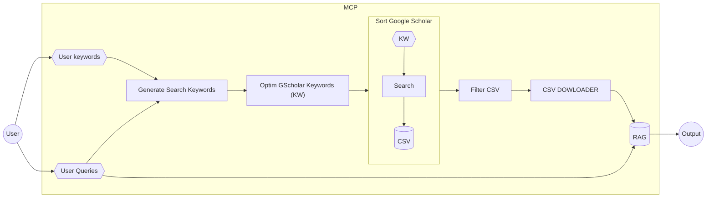

# SORT GOOGLE SCHOLAR MCP

Original project: https://github.com/WittmannF/sort-google-scholar

El plan de este proyecto es hacer un upgrade del proyecto original para
extender las capacidades del repositorio y habilitarlo como un MCP para ser
consumido por agentes de IA

